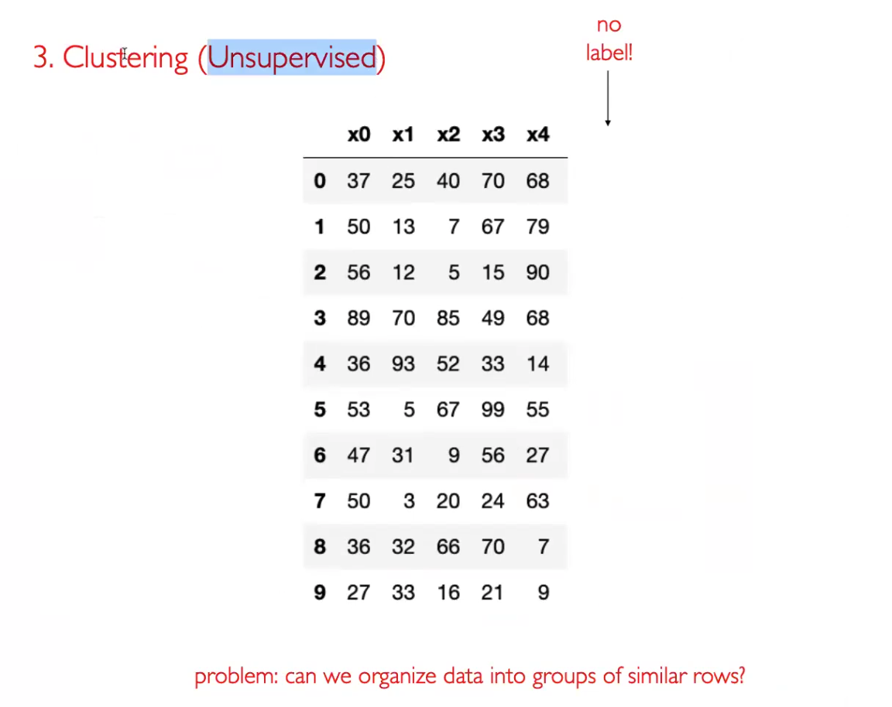
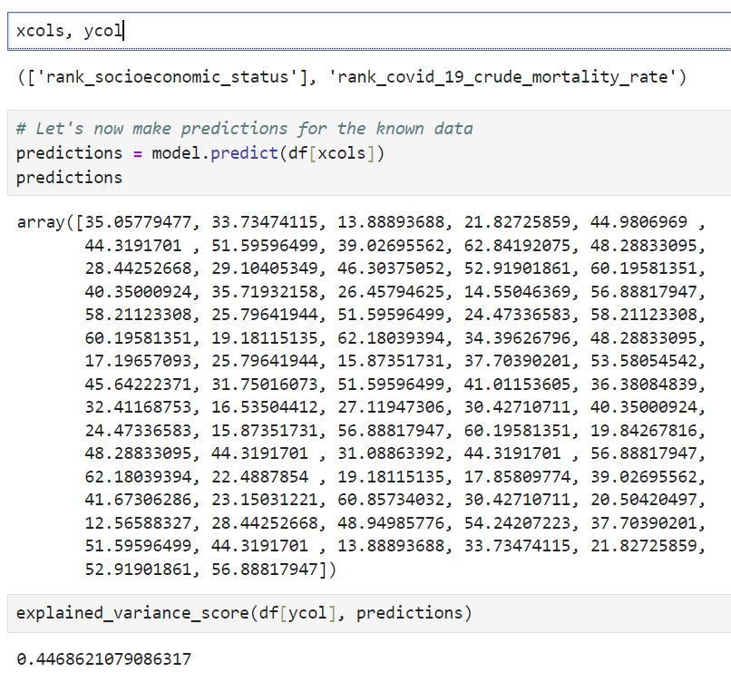
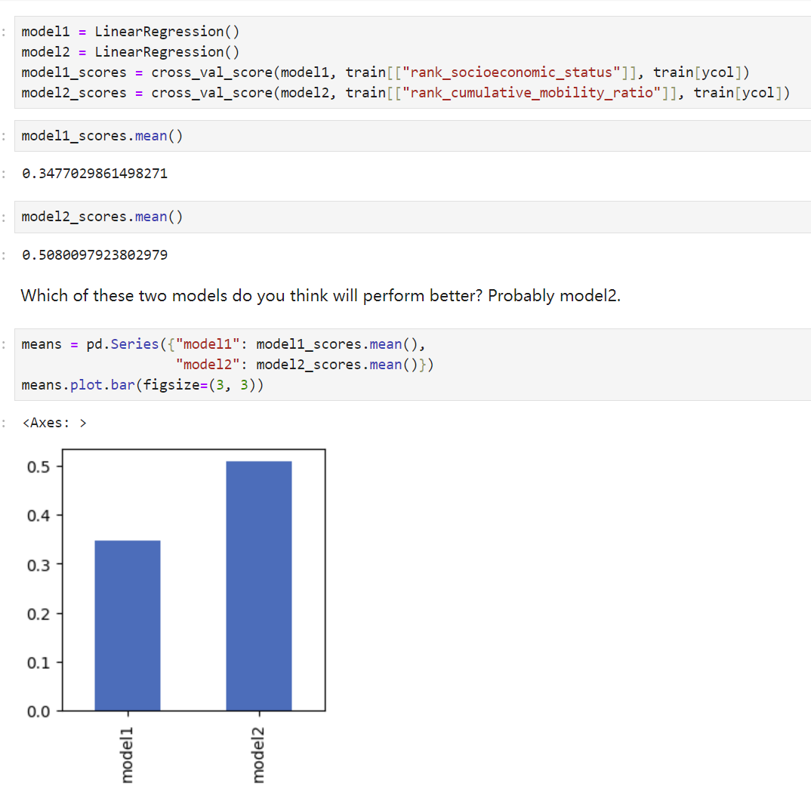
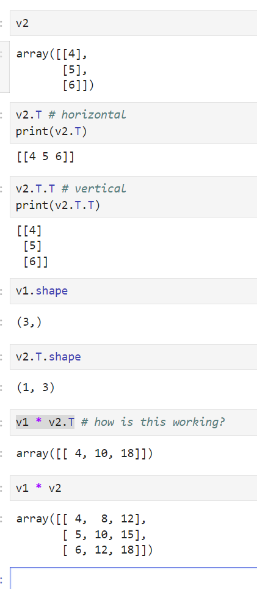
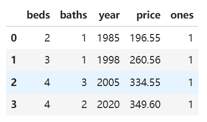
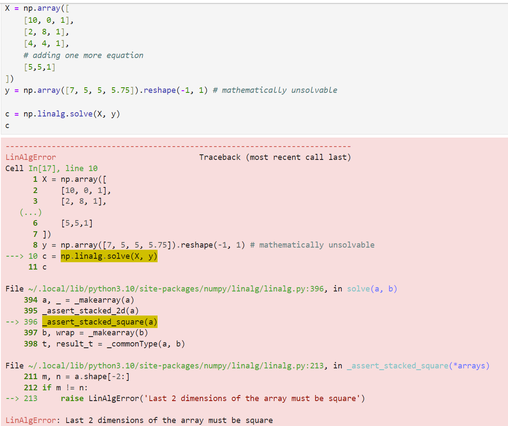
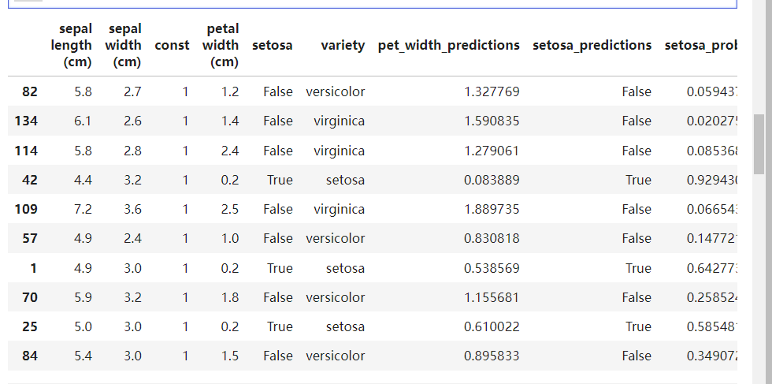
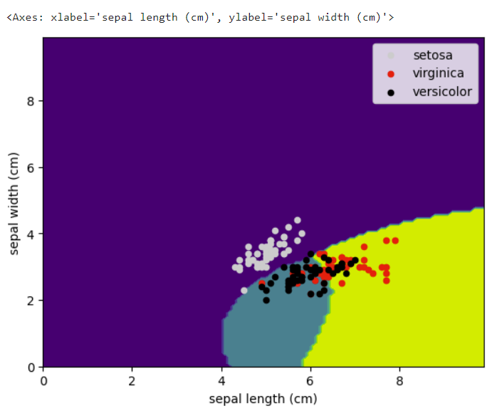

# Machine Learning
机器学习理论主要是设计和分析一些让计算机可以自动“学习”的算法。机器学习算法是一类从数据中自动分析获得规律，并利用规律对未知数据进行预测的算法。因为学习算法中涉及了大量的统计学理论，机器学习与推断统计学联系尤为密切，也被称为统计学习理论。算法设计方面，机器学习理论关注可以实现的，行之有效的学习算法（要防止错误累积）。很多推论问题属于非程序化決策，所以部分的机器学习研究是开发容易处理的近似算法。

## Supervised Machine Learning

Supervised machine learning 是一种人工智能(AI)和机器学习(ML)的方法，通过使用带有标签的数据来训练算法，以便它能够学习如何预测或分类新的、未见过的数据。这里的“监督”指的是学习过程中使用的数据集包含了输入数据和对应的正确输出（即标签），模型通过这些数据进行学习。

这个过程可以分解为以下几个步骤：

    收集数据：首先，需要收集相关的数据。这些数据可能来源于各种渠道，比如日志文件、数据库、在线资源等。

    预处理和清洗数据：数据通常需要经过清洗和预处理，以去除噪声、处理缺失值、格式化以及其他必要的步骤，使其适合用于模型训练。

    标注数据：在监督学习中，每个样本数据都需要有一个对应的标签或输出。例如，在图片识别任务中，每张图片都需要标注为“狗”、“猫”或其他类别。

    选择模型：根据问题的性质，选择适当的机器学习模型。常见的模型包括决策树、随机森林、神经网络等。

    训练模型：使用收集到的带标签的数据训练选定的模型。在这个过程中，算法会尝试学习数据之间的关系，以便能够根据输入预测出正确的输出。

    评估模型：使用一部分之前未参与训练的数据来测试模型的性能。评估指标可能包括准确率、召回率、F1分数等，具体取决于任务的性质。

    参数调优和优化：根据模型的初步表现，调整模型参数或使用不同的模型结构来提高性能。

    部署模型：一旦模型表现令人满意，它就可以被部署到生产环境中，对新数据进行预测或分类。


### Regression
回归旨在预测一个连续的数值。使用回归模型，我们可以基于输入数据预测一个实数值的输出。这类问题的关键是预测的目标变量是连续的。回归分析广泛应用于预测和预测分析领域，例如：

预测房价：根据房屋的位置、大小、年龄等特征来预测房价。
股票价格预测：根据历史数据和其他经济指标预测股票的未来价格。
气温预测：根据过去的天气数据来预测未来的气温。
常见的回归算法包括线性回归、多项式回归、岭回归（Ridge Regression）、套索回归（Lasso Regression）和弹性网回归（Elastic Net Regression）等。

### Classification

分类旨在预测一个离散的标签。使用分类模型，我们可以将输入数据分配到两个或多个类别中。这类问题的关键是预测的目标变量是离散的，或者说是类别的。分类广泛应用于许多领域，如：

邮件过滤：将电子邮件分类为“垃圾邮件”或“非垃圾邮件”。
客户流失预测：预测客户是否会在未来一段时间内离开或继续使用服务。
图像识别：识别图像中的对象属于哪个类别，例如狗、猫或汽车。
分类问题可以是二分类（如判断邮件是否为垃圾邮件）或多分类（如识别图片中的物体属于哪个类别）。常见的分类算法包括逻辑回归、决策树、随机森林、支持向量机（SVM）、神经网络等。

总结来说，回归和分类的主要区别在于输出变量的类型：回归预测连续变量，而分类预测离散变量。选择哪种类型的监督学习方法取决于具体问题的需求和数据的性质。


## Unsupervised Machine Learning

无监督学习（Unsupervised Machine Learning）是机器学习的一种方法，它与监督学习不同，不依赖于带有标签的数据。在无监督学习中，算法被训练在没有任何先验标签的情况下，仅仅基于数据的内在结构和模式来分析和推理数据。这种学习方法主要用于探索性数据分析、发现隐藏模式或数据压缩。无监督学习的主要类型包括聚类、降维和关联规则学习。

### Clustering

聚类（Clustering）
聚类是一种将数据点分组的无监督学习方法，使得同一组内的数据点彼此相似，而不同组的数据点相异。它用于数据挖掘和统计数据分析，以发现数据中的隐藏模式或分组。常见的聚类算法包括K-均值（K-means）、层次聚类（Hierarchical Clustering）和DBSCAN等。


## Decomposition
try to group data(very large), and use maybe two or three col to representation all of the col


train you function


使用大概20%的数据去测试你model


use model to predict data





 


### Regression

```python

import pandas as pd
import geopandas as gpd
import os
import matplotlib.pyplot as plt
# new import statements
from sklearn.linear_model import LinearRegression
from sklearn.metrics import explained_variance_score, r2_score
from sklearn.model_selection import train_test_split
from sklearn.model_selection import cross_val_score
```


```python
url = "https://data.cityofchicago.org/resource/xhc6-88s9.geojson"
df = gpd.read_file(url)
df.to_file("ccvi.geojson")  # save it as local file
```


现在可以优化一下上面的代码, 不需要在每次重新运行的时候重新下载

```python
# Do not reptitivitely download datasets
# Save a local copy instead
if os.path.exists("ccvi.geojson"): 
    print("read local file")
    df = gpd.read_file("ccvi.geojson")
else: 
    print("download the dataset")
    url = "https://data.cityofchicago.org/resource/xhc6-88s9.geojson"
    df = gpd.read_file(url)
    df.to_file("ccvi.geojson")

```


在一些dataframe中有一些None， 或者一些missing value，我们不想处理以下是改如何操作。

```python
# How many rows have missing values?
df['rank_covid_19_incidence_rate'].isna().value_counts()
```


```python
# row has missing values if its geography_type is ZIP
df['geography_type'].value_counts()
```


```python
# remove rows that have missing values
df = df[df['geography_type'] == 'CA']
```

double check

```python
df['rank_covid_19_incidence_rate'].isna().value_counts()
```


```python
# list the type of each column
df.dtypes
```

因为数据都是object type，会存在一些missing value， 因此画图是不准确的。我们需要typecasting。

```python

# extract the columns we want to type caste
columns_typecasting = list(df.columns)
columns_typecasting.remove('community_area_name')
columns_typecasting.remove('geometry')
columns_typecasting.remove('ccvi_category')
columns_typecasting.remove('geography_type')
columns_typecasting

df[columns_typecasting] = df[columns_typecasting].apply(pd.to_numeric)

df.dtypes
```


apply函数对DataFrame的每一列（或行）应用一个函数。在这个例子中，应用的函数是pd.to_numeric。pd.to_numeric是Pandas库中的一个函数，用于将一个列或Series中的数据转换成数值类型。默认情况下，它会将不能转换为数值的值转换成NaN（代表“非数字”）。


## How can we train/fit models to known data to predict unknowns?
- Feature(s) => Predictions
    - Population => Deaths
    - Cases => Deaths
    - Cases by Age => Deaths
    
- General structure for fitting models:
    ```python
    model = <some model>
    model.fit(X, y) # X stands for feature matrix, y stands for prediction label
    y = model.predict(X)
    ```
    where `X` needs to be a matrix or a `DataFrame` and `y` needs to be an array (vector) or a `Series`
```python
# We must specify a list of columns to make sure we extract a DataFrame and not a Series
# Feature DataFrame
df[["rank_socioeconomic_status"]].head()
# 两个[[]]可以取出一个data frame
```


训练machine

```python
xcols = ["rank_socioeconomic_status"]
ycol = "rank_covid_19_crude_mortality_rate"

model = LinearRegression()
model.fit(df[xcols], df[ycol])
# less interesting because we are predicting what we already know
y = model.predict(df[xcols])
y
# df[xcols]是自变量的数据，df[ycol]是因变量的数据。这个方法计算了最佳的拟合线，使得预测值和实际值之间的差异最小。
```


Predicting for new values of x

```python
predict_df = pd.DataFrame({"rank_socioeconomic_status":[10,20,30]})
predict_df

```


```python

predict_df = pd.DataFrame({"rank_socioeconomic_status": range(0, 81, 10)})

predict_df["predicted_mortality_rate_rank"] = model.predict(predict_df) 
predict_df
```


```python

# Create a line plot to visualize relationship between "rank_socioeconomic_status" and "predicted_mortality_rate_rank"
ax = predict_df.plot.line(x="rank_socioeconomic_status", y="predicted_mortality_rate_rank", color="r")
# Create a scatter plot to visualize relationship between "rank_socioeconomic_status" and "predicted_mortality_rate_rank"
df.plot.scatter(x="rank_socioeconomic_status", y="rank_covid_19_crude_mortality_rate", ax=ax, color="k")

```


```python
# Model coefficients
model.coef_
# numpy array
# array([0.66152681])


# Slope of the line
model.coef_[0]

# 0.6615268089620371


# Intercept of the line
model.intercept_

# 12.565883265292989


print(f"mortality_rate_rank ~= {round(model.coef_[0], 4)} * socioeconomic_status_rank + {round(model.intercept_, 4)}")
```


### How well does our model fit the data?
- explained variance score
- R^2 ("r squared")

#### `explained_variance_score(y_true, y_pred)`
- `from sklearn.metrics import explained_variance_score`
- calculates the explained variance score given:
    - y_true: actual death values in our example
    - y_pred: prediction of deaths in our example
- documentation: https://scikit-learn.org/stable/modules/generated/sklearn.metrics.explained_variance_score.html





- explained_variance try to explain how many variance(方差) of you prediction are with respective to actual variance


#### Explained variance score
- `explained_variance = (known_var - explained_variance) / known_var`
    - where `known_var = y_true.var()` and `explained_variance = (y_true - y_pred).var()`

```python
# Compute variance of "predicted_mortality_rate_rank" column
known_var = df[ycol].var()
known_var


# explained_variance
explained_variance = (df[ycol] - predictions).var()   
explained_variance


# explained_variance score
explained_variance_score = (known_var - explained_variance) / known_var
explained_variance_score

# 1 => best score - infty => lowest score

```


#### `r2_score(y_true, y_pred)`

- - `from sklearn.metrics import r2_score`
- calculates the explained variance score given:
    - y_true: actual death values in our example
    - y_pred: prediction of deaths in our example
- documentation: https://scikit-learn.org/stable/modules/generated/sklearn.metrics.r2_score.html 


#### R^2 score (aka coefficient of determination) approximation

- `r2_score = (known_var - r2_val) / known_var`
    - where `known_var = y_true.var()` and `r2_val = ((y_true - y_pred) ** 2).mean()`

```python
r2_score(df[ycol], predictions) #defalut is explain variance score


# r2_val
r2_val = ((df[ycol] - predictions) ** 2).mean()
r2_val


```


- Split data into train and test sets
- Use the test sets to tell

```python
# Split the data into two equal parts
len(df) // 2

# Manual way of splitting train and test data
train, test = df.iloc[:len(df)//2], df.iloc[len(df)//2:]
len(train), len(test)
```

Problem with manual splitting is, we need to make sure that the data is not sorted in some way.


#### `train_test_split(<dataframe>, test_size=<val>)`

- requires `from sklearn.model_selection import train_test_split`
- shuffles the data and then splits based on 75%-25% split between train and test
    - produces new train and test data every single time
- `test_size` parameter can take two kind of values:
    - actual number of rows that we want in test data
    - fractional number representing the ratio of train versus test data
    - default value is `0.25`
- documentation: https://scikit-learn.org/stable/modules/generated/sklearn.model_selection.train_test_split.html


```python
train, test = train_test_split(df)
len(train), len(test) # splits based on 75%-25%

# (75% data, 25% data)
#(57,20)


# Test size using row count
train, test = train_test_split(df, test_size=30)
len(train), len(test)
#(47,30)


# Test size using fraction
train, test = train_test_split(df, test_size=0.5)
len(train), len(test)
#(38, 39)
```


```python

train, test = train_test_split(df)

# Let's use the train and the test data
model = LinearRegression()
# Fit using training data
model.fit(train[xcols], train[ycol])
# Predict using test data
y = model.predict(test[xcols])
# We can use score directly as it automatically invokes predict
model.score(test[xcols], test[ycol])

```


因为 test data是在之前从未见过的因此分数很低。这也是检测是否overfit
<b>overfit</b> model on particular data set and it's not perform as good in new data set.


还有一种检测overfiting的方式

#### Cross Validation:
`cross_val_score(estimator, X, y)`
- requires `from sklearn.model_selection import cross_val_score`
-  do many different train/test splits of the values, fitting and scoring the model across each combination
-  
它更具有计算成本， 通常你的model有很多数据，但是不知道哪个配置是最好的，但是可以通过这个方式来确定最好的配置。
功能：
如果有两个model，选择一个最好的
有有一些参数我们想调整model， 哪一个set of param可以给我们更好的表现


默认组合是5个set，但是可以设置

下面是个例子，从两个model中选择一个最好的



因此在这个情况下我们会选择第二个
第二个model高是因为shuffling会对其造成一些影响，
如果数据量很小的话shuffling会对结果造成影响。
cross validation, 减少了shuffling

因此需要计算standard deviation来确定shuffling并没有对数据造成很大的影响

.png)

在这种情况下sd越小说明model表现得越好。因此我们会选择model 2


有负的coef是正常的，因为一些因素的增长可能会造成一些负面的影响


## Pipeline


#### `PolynomialFeatures(degree=<val>, include_bias=False)`


```python3

from sklearn.preprocessing import PolynomialFeatures, OneHotEncoder
from sklearn.pipeline import Pipeline
from sklearn.compose import make_column_transformer

```

- `degree` enables us to mention how many degrees we need
- 参数用来设置多项式的最高次数
- 
- `include_bias` default value is True, which will add a column of 1s - we typically don't use that. （Constant trend）
- returns an object instance on which we can invoke `fit` and 
- 如果 include_bias=True，那么在生成的多项式特征中会包括一个值恒为1的特征。这个常数1可以在模型中充当  b0

​
  的角色，允许模型在不依赖其他变量的情况下，有一个非零的起点。
- `transform`:
    - `transform(X, columns=<col names>)`: transform data to polynomial features`
    - `fit_transform(X[, y])`: fit to data, then transform it.
- documentation: https://scikit-learn.org/stable/modules/generated/sklearn.preprocessing.PolynomialFeatures.html


如果 include_bias = True,会多一列1：


`fit_transform(X[, y])`: fit to data, then transform it.
会有相同的结果


#### `Pipeline(...)`
Pipeline allows you to sequentially apply a list of transformers to preprocess the data and, if desired, conclude the sequence with a final predictor for predictive modeling.


Intermediate steps of the pipeline must be ‘transforms’, that is, they must implement fit and transform methods. The final estimator only needs to implement fit. The transformers in the pipeline can be cached using memory argument.

- Argument: list of steps in the pipeline:
    - each step represented as a tuple with name of the step and the object instance
    - last step will be the estimator


#### `OneHotEncoder()`
One-Hot Encoding 是一种处理分类变量的方法，常用于数据预处理阶段，以适应那些只能处理数值数据的机器学习模型。这种编码方法通过将每个类别变量转换为一个或多个二进制列来表示，每个类别对应一个列。当某个类别存在时，其对应的列值为 1，其余列值为 0。这种方法主要用于将分类数据转换为格式化的数值数据，以便机器学习算法能够更好地处理。
- encodes categorical features as a one-hot numeric array
- returns a "sparse matrix", which needs to be explicitly converted into an `array` using `to_array()` method, before `DataFrame` conversion
- documention: https://scikit-learn.org/stable/modules/generated/sklearn.preprocessing.OneHotEncoder.html


每一行只有一个1，意思是，第一行来自 Ohio Street Beach
第二行来自 Calumet Beach


#### `make_column_transformer(...)`
make_column_transformer 是 scikit-learn 库中的一个函数，用于构建一个“列转换器”，它能够同时对数据集中的多个列应用不同的预处理步骤。这使得在单个步骤中，针对不同类型的数据（如数值数据和分类数据）执行不同的转换成为可能。这对于处理含有多种数据类型的复杂数据集非常有用，且常用于机器学习的数据预处理阶段。
- Argument: transformations
    - each transformer argument will be a `tuple` with object instance as first item and list of feature columns as the second
- documention: https://scikit-learn.org/stable/modules/generated/sklearn.compose.make_column_transformer.html

make_column_transformer 通过创建一个能够对数据集的不同列执行不同转换操作的管道，简化了数据预处理的过程。比如，你可以为分类数据设置 One-Hot Encoding，同时为数值数据设置标准化或归一化处理。


可以在不同的col上做不同的transformation


这样这个model在不overfit的情况下预测test结果的表现是非常好的


#### Numpy

```python
import numpy as np
```


NumPy（Numerical Python 的缩写）是 Python 编程语言的一个非常重要的库，主要用于进行高效的数值计算。它提供了一个强大的N维数组对象，以及用于操作这些数组的广泛工具和函数。NumPy 是科学计算中最核心的 Python 包之一，广泛应用于数据分析、机器学习、工程科学、图像处理等领域。

核心功能
多维数组对象（ndarray）：
NumPy 数组是一个多维数组对象，称为 ndarray。它是一个具有统一类型（通常是数值类型）元素的集合，可以进行高效的向量化运算。
广播功能：
广播是 NumPy 的一个强大功能，它允许不同形状的数组进行算术运算的能力。较小的数组会在运算过程中自动扩展以匹配较大数组的形状。
数组索引和切片：
NumPy 提供了多种方式来索引和切割数组，允许高效地访问和修改数组的部分内容。
数学函数库：
NumPy 提供了大量的数学函数，如三角函数、指数函数、对数函数等，它们都可以直接作用于数组级别，从而实现快速的向量运算。
线性代数支持：
NumPy 包含了基本的线性代数函数，包括矩阵乘法、矩阵分解、行列式、求解线性系统等。
随机数生成：
NumPy 也提供了生成各种概率分布的随机数的工具。


这些都是numpy array


#### How does `predict` actually work?

- Matrix multiplication with coefficients (`@`) and add intercept


```python
# create numpy array
np.array([7,8,9])
# array([7, 8, 9])

# Creating numpy array of 8 1's
np.ones(8)
# array([1., 1., 1., 1., 1., 1., 1., 1.])

# Creating numpy array of 8 0's
np.zeros(8)
```


#### Back to `numpy`
- `np.arange([start, ]stop, [step, ])`: gives us an array based on range; documentation: https://numpy.org/doc/stable/reference/generated/numpy.arange.html


#### Review: Slicing

- `seq_object[<START>:<exclusive_END>:<STEP>]`
    - `<START>` is optional; default is index 0
    - `<END>` is optional; default is `len` of the sequence
- slicing creates a brand new object instance


python list
```python
# create copy, 因此change b并不会影响a的内容
a = [7, 8, 9, 10]
# slice out 8 and 10
b =  a[1::2] # 1 is index, 2 is step 1+2=3, 10 index is 3
b
#[8, 10]   ##这里其实做了一个deep copy


b[1] = 100
#[8,100]

```

version in numpy

```python
a = np.array([7, 8, 9, 10])
b = a[1::2]
b
# array([ 8, 10])

b[1] = 100
a

# array([  7,   8,   9, 100])

```

<font color = "red">注意：</font>这里的a发生了改变，是因为在numpy中，b依旧是referencing a，因此对b进行改变，a也会改变。

How can you ensure that changes to a slice don't affect original `numpy.array`? Use `copy` method.


```python
a = np.array([7, 8, 9, 10])
b = a.copy() # copy everything instead of sharing
b = a[1::2] 
b[1] = 100
b, a
# (array([  8, 100]), array([  7,   8,   9, 100]))
```


#### Creating Multi-Dimensional Arrays

- using nested data structures like list of lists
- `shape` gives us the dimension of the `numpy.array`
- `len()` gives the first dimension, that is `shape[0]`


#### How to reshape a `numpy.array`?

- `<obj>.reshape(<newshape>)`: reshapes the dimension of the array; documentation: https://numpy.org/doc/stable/reference/generated/numpy.reshape.html

```python
b.reshape(3,2)


# array([[1, 2],
    #    [3, 4],
    #    [5, 6]])


b.reshape(6)
# array([1, 2, 3, 4, 5, 6])

b.reshape(5)
# 这个会出现报错，因为reshape的规则是，必须可以被total number 整除。
cannot reshape array of size 6 into shape (5,)

```

-1 means whatever size is the necessary shape for the remaining values. Enables us to just control one of the dimensions.

-1表示剩余部分的大小。

```python
# Use .reshape to change the dimensions to 3 x something valid
b.reshape(3,-1)

# array([[1, 2],
#        [3, 4],
#        [5, 6]])

b.reshape(-1)
# array([1, 2, 3, 4, 5, 6]) calculate dimensions size of only 1 dimensions using
```


### Vocabulary
- scalar: 0 dimensional array
- vector: 1 dimensional array
- matrix: 2 dimensional array
- tensor: n dimensional (0, 1, 2, 3, ...) array 


### Images as Tensors

- `wget` command:
    - `wget <url> -O <local file name>`


#### How to read an image file?

- required `import matplotlib.pyplot as plt`
    - `plt.imread(<fname>)`: reads an image file into a 3-dimensional array --- rows(pixels), columns(pixels), colors (red/green/blue)
    - `plt.imshow(<array>, cmap=<color map>)`: displays the image


a is using number to represent image


#### GOAL: crop down just to the bug using slicing

- `<array>[ROW SLICE, COLUMN SLICE, COLOR SLICE]`


Wherever there was red, the image is bright. The bug is very bright because of that. There are other places in the image that are bright but were not red. This is because when we mix RGB, we get white. Any color that was light will also have a lot of RED.

This could be a pre-processing step for some ML algorithm that can identify RED bugs. 


#### GOAL: show a grayscale that considers the average of all colors

- `<array>.mean(axis=<val>)`:
    - `axis` should be 0 for 1st dimension, 1 for 2nd dimension, 2 for 3rd dimension

```python
# average over all the numbers
# gives a measure of how bright the image is overall
a.mean()

# 91.74619781513016

a.shape
# (1688, 2521, 3)
# average over each column and color combination
a.mean(axis=0).shape  
# (2521, 3)

# 指定的 axis=0 表示沿着第一个维度（即沿着形状中的1688）进行计算。这意味着你将对所有1688个元素（在这个上下文中可能是图像）的相同位置的值取平均。计算后，这个维度会被压缩或者消除，结果中不再包含这个维度。
# average over each row and color combination
a.mean(axis=1).shape  
# (1688, 3)


# average over each row and column combination
a.mean(axis=2).shape
# (1688, 2521)
```

using average of all color


注意这里与上面的图像还有所区别，这是平均值，但是在上面是用0，也就是red，所以高亮更明显。


### Vector Multiplication: Overview

#### Elementwise Multiplication

$\begin{bmatrix}
1 \\ 2 \\ 3
\end{bmatrix}
*
\begin{bmatrix}
4 \\ 5 \\ 6
\end{bmatrix}$

$\begin{bmatrix}
1 \\ 2 \\ 3
\end{bmatrix}
*
\begin{bmatrix}
4 & 5 & 6
\end{bmatrix}$


```python
# Use .reshape to change the dimensions to something valid x 1 
# vertical shape
v1 = np.array([1, 2, 3])
v1
#array([1, 2, 3])

v2 = np.array([4, 5, 6]).reshape(-1, 1)
v2
# array([[4],
    #    [5],
    #    [6]])
```


```python
v1 * v2   # [1*4, 2*5, 3*6]  
# 注意 * element wise multiplication
# @ 是matrix multiplication
# 因此会获得这样的结果
# array([[ 4,  8, 12],
#        [ 5, 10, 15],
#        [ 6, 12, 18]])

v1 @ v2

#array([32])
```


直接进行dot production
$\begin{bmatrix}
1 \\ 2 \\ 3
\end{bmatrix}
*
\begin{bmatrix}
4 \\ 5 \\ 6
\end{bmatrix}$

这是没有办法进行matrix multiplication的
但是可以dot production

```python
v1 = np.array([1, 2, 3])
v1
#array([1, 2, 3])

v2 = np.array([4, 5, 6])
v2
#array([4, 5, 6])

v1 * v2
#array([ 4, 10, 18])
```


#### Transpose

- flips the x and y




Transpose是如何运作的


```python
v1 = np.array([1, 2, 3]).reshape(-1, 1)
v1


# array([[1],
#        [2],
#        [3]])


v2 = np.array([4, 5, 6]).reshape(-1, 1)
v2


# array([[4],
#        [5],
#        [6]])


v1 * v2 # 1*4, 2*5, 3*6
# array([[ 4],
#        [10],
#        [18]])
```

$\begin{bmatrix}
1 \\ 2 \\ 3
\end{bmatrix}
*
\begin{bmatrix}
4 \\ 5 \\ 6
\end{bmatrix}$
\=
$\begin{bmatrix}
4 \\ 10 \\ 18
\end{bmatrix}$


```python
v2.T
#array([[4, 5, 6]])
v1 * v2.T  # how is this working?  会boardcast
# array([[ 4,  5,  6],
#        [ 8, 10, 12],
#        [12, 15, 18]])
```

$\begin{bmatrix}
1 \\ 2 \\ 3
\end{bmatrix}
*
\begin{bmatrix}
4 & 5 & 6
\end{bmatrix}$
\=
?


## Broadcast

When compute A * B:
- If A and B have the same number of dimensions: 
    - Match the size of any dim by stretching 1 => N (rule 1)
- else: 
    - add dimensions of size 1 to the beginning of a shape (rule 2)


#### `np.concatenate([a1, a2, ...], axis=0)`.
- `a1, a2, …`: sequence of arrays
- `axis`: the dimension along with we want to join the arrays
    - default value is 0, which is for row dimension (vertically)
    - value of 1 is for column dimension (horizontally)


np.concatenate() 是 NumPy 库中的一个函数，用于沿指定轴连接数组序列。这个函数可以处理不同维度的数组，但要求除了指定的轴之外，所有其他轴的长度必须相同。

参数解释
a1, a2, ... : 这些是需要连接的数组，可以是任意数量，但它们必须具有相同的形状，除了在指定的轴上。
axis=0 : 这指定了数组将要沿着哪个轴进行连接。默认情况下，axis=0，意味着连接操作是沿着第一个轴（即行方向，对于2D数组）进行的。


## Predicting with Matrix Multiplication

1. use case for matrix multiplication:
    - `y = Xc + b`
2. one's column
3. matrix multiply vector

$\begin{bmatrix}
1 & 2 \\ 3 & 4\\
\end{bmatrix}
\cdot
\begin{bmatrix}
10 \\ 1 \\
\end{bmatrix}$


```python
houses = pd.DataFrame([[2, 1, 1985],
                       [3, 1, 1998],
                       [4, 3, 2005],
                       [4, 2, 2020]],
                      columns=["beds", "baths", "year"])
houses

```


```python
def predict_price(house):
    """
    Takes row (as Series) as argument,
    returns estimated price (in thousands)
    """
    return ((house["beds"]*42.3) + (house["baths"]*10) + 
            (house["year"]*1.67) - 3213)

predict_price(houses.iloc[0])


# 196.54999999999973

```
以上这个过程比较繁琐，因此可以通过matrix来简化步骤，

以下是优化

```python
# How do we convert a DataFrame into a numpy array?
X = houses.values
X

# 结果会转换为numpy array

# array([[   2,    1, 1985],
#        [   3,    1, 1998],
#        [   4,    3, 2005],
#        [   4,    2, 2020]])


house0 = X[0:1,:]
house0

#array([[   2,    1, 1985]])


# Create a vertical array (3 x 1) with the co-efficients
c = np.array([42.3, 10, 1.67]).reshape(-1,1)
c

# 这里是将上面×的数转换为一个np array

# array([[42.3 ],
#        [10.  ],
#        [ 1.67]])

# 并且将其reshape 为（3，1）
# 因此可以做matrix multiplication


# horizontal @ vertical
house0 @ c

# array([[3409.55]])

```
更具这个公式
`y = Xc + b`
house0 @ c - 3213    # 3213是intercept


另一种更简便的方式，可以将-3213作为一列放入c中

```python
c = np.array([42.3, 10, 1.67, -3213]).reshape(-1, 1)
c

# array([[ 4.230e+01],
#        [ 1.000e+01],
#        [ 1.670e+00],
#        [-3.213e+03]])

# 注意这里没有办法直接使用house0 @ c， 因为dimension不同
因此我们需要在X中多加一列为1的元素

one_col = np.ones(4).reshape(-1,1) 
# array([[1.],
#        [1.],
#        [1.],
#        [1.]])
X = np.concatenate([X, ones_column], axis=1)
X
# 这的axis = 1 可以理解为增加宽度，
# axis = 0是增加长度

# array([[2.000e+00, 1.000e+00, 1.985e+03, 1.000e+00],
#        [3.000e+00, 1.000e+00, 1.998e+03, 1.000e+00],
#        [4.000e+00, 3.000e+00, 2.005e+03, 1.000e+00],
#        [4.000e+00, 2.000e+00, 2.020e+03, 1.000e+00]])


# 这个时候可以进行matrix multiplication


house0 = X[0:1, :]
house0

#array([[2.000e+00, 1.000e+00, 1.985e+03, 1.000e+00]])

house0 @ c

# array([[196.55]])
# 结果是一样的


# Extracting each house and doing the prediction
# Cumbersome
house0 = X[0:1, :]
print(house0 @ c)
house1 = X[1:2, :]
print(house1 @ c)
house2 = X[2:3, :]
print(house2 @ c)
house3 = X[3:4, :]
print(house3 @ c)

# [[196.55]]
# [[260.56]]
# [[334.55]]
# [[349.6]]

以上这些代码等价于下面的代码

X @ c

# array([[196.55],
#        [260.56],
#        [334.55],
#        [349.6 ]])

```

### Fitting with `np.linalg.solve`


**Above:** we estimated house prices using a linear model based on the matrix multiplication as follows:

$Xc = y$

* $X$ (known) is a matrix with house features (from DataFrame)
* $c$ (known) is a vector of coefficients (our model parameters)
* $y$ (computed) are the prices

**Below:** what if X and y are know, and we want to find c?

使用model来train function 从而获取最好的coef


If we assume price is linearly based on the features, with this equation:

* $beds*c_0 + baths*c_1 + year*c_2 + 1*c_3 = price$

Then we get four equations:

* $2*c_0 + 1*c_1 + 1985*c_2 + 1*c_3 = 196.55$
* $3*c_0 + 1*c_1 + 1998*c_2 + 1*c_3 = 260.56$
* $4*c_0 + 3*c_1 + 2005*c_2 + 1*c_3 = 334.55$
* $4*c_0 + 2*c_1 + 2020*c_2 + 1*c_3 = 349.60$


#### `c = np.linalg.solve(X, y)`

- documentation: https://numpy.org/doc/stable/reference/generated/numpy.linalg.solve.html


```python
houses['ones'] = 1
houses

```



```python
X = houses[["beds", "baths", "year", "ones"]].values
X


# array([[   2,    1, 1985,    1],
#        [   3,    1, 1998,    1],
#        [   4,    3, 2005,    1],
#        [   4,    2, 2020,    1]])


y = houses[["price"]].values
y


# array([[196.55],
#        [260.56],
#        [334.55],
#        [349.6 ]])
```


```python

c = np.linalg.solve(X,y)   # 通过模型计算出来的coef  -3.213e+03
c

# array([[ 4.230e+01],
#        [ 1.000e+01],
#        [ 1.670e+00],
#        [-3.213e+03]])


X @ c 

# array([[196.55],
#        [260.56],
#        [334.55],
#        [349.6 ]])

# 下面来做一个预测
dream_house = np.array([2,2,2024,1])
dream_house @ c

# array([271.68])


```


### Two Perspectives on `Matrix @ vector`

$\begin{bmatrix}
4&5\\6&7\\8&9\\
\end{bmatrix}
\cdot
\begin{bmatrix}
2\\3\\
\end{bmatrix}
= ????
$


```python
X = np.array([[4, 5], [6, 7], [8, 9]])
c = np.array([2, 3]).reshape(-1, 1)
X @ c


# array([[23],
#        [33],
#        [43]])


```


### Row Picture


```python
def matrix_multi_by_row(X, c):
    """
    function that performs same action as @ operator
    """
    res = []
    for row_idx in range(X.shape[0]):
        row = X[row_idx:row_idx+1,:]
        res.append((row @ c).item())
    return np.array(res).reshape(-1,1)
matrix_multi_by_row(X, c)

```


### Column Picture


```python

def matrix_multi_by_col(X, c):
    """
    same result as matrix_multi_by_row above, 
    but different approach
    """
    total = np.zeros(X.shape[0]).reshape(-1, 1)
    # loop over each col index of X
    for col_idx in range(X.shape[1]):
        # extract each column using slicing
        col = X[:, col_idx:col_idx+1]
        # extract weight for the column using indexing
        weight = c[col_idx, 0]
        # add weighted column to total
        total += col * weight
    return total
matrix_multi_by_col(X, c)

# 能和上面得到一样的结果

```


## Linear Algebra 3

### Part 1: Column Space of a Matrix

Definition: the *column space* of a matrix is the set of all linear combinations of that matrix's columns.

```python

A = np.array([
    [1, 100],
    [2, 10],
    [3, 0]
])
B = np.array([
    [1, 0],
    [0, 2],
    [0, 3],
    [0, 0]
])

```


```python
# this is in the column space of A (it's a weighted mix of the columns)
A @ np.array([2,3]).reshape(-1,1)

# linear combination

#array([[302],
    #    [ 34],
    #    [  6]])


A @ np.array([-1, 0]).reshape(-1, 1)

# array([[-1],
#        [-2],
#        [-3]])


A @ np.array([0, 2]).reshape(-1, 1)

# array([[200],
#        [ 20],
#        [  0]])


A @ np.array([0, 0]).reshape(-1, 1)


# array([[0],
#        [0],
#        [0]])
```


A right-sized zero vector will always be in the column space.


What vectors are in the column space of B?

$B = \begin{bmatrix}
1&0\\
0&2\\
0&3\\
0&0\\
\end{bmatrix}$

$a=\begin{bmatrix}
2\\
2\\
3\\
0
\end{bmatrix}, b=\begin{bmatrix}
0\\
0\\
0\\
1
\end{bmatrix}, c=\begin{bmatrix}
-10\\
0\\
0\\
0
\end{bmatrix}, d=\begin{bmatrix}
0\\
-2\\
3\\
0
\end{bmatrix}, e=\begin{bmatrix}
-1\\
2\\
3\\
0
\end{bmatrix}$


```python
# vector in columns space of B:a , c,  e
c = np.array([-1, 1]).reshape(-1, 1) # coef
B @ c

```

### Solution
- in the column space of B: 
    - a [2, 1]
    - c [-10, 0]
    - e [-1, 1]
- not in the column space: 
    - b (no weighting of 0 and 0 can make a 1)
    - d (if you multiple 2 and 3 by the same constant, the sign will be the same)


### Part 2: When can we solve for c?

Suppose $Xc = y$.

X is feature col, y is label col, c is coef

$X$ and $y$ are known, and we want to solve for $c$.

When does `c = np.linalg.solve(X, y)` work?

#### Fruit Sales Example

##### Data

* `10 apples and 0 bananas sold for $7`
* `2 apples and 8 bananas sold for $5`
* `4 apples and 4 bananas sold for $5`

##### Equations

* `10*apple + basket = 7`
* `2*apple + 8*banana + basket = 5`
* `4*apple + 4*banana + basket = 5`


```python
X = np.array([
    [10, 0, 1],
    [2, 8, 1],
    [4, 4, 1],
])
y = np.array([7, 5, 5]).reshape(-1, 1)

c = np.linalg.solve(X, y)
c  # coef

# array([[0.5 ],
#        [0.25],
#        [2.  ]])
# use this code to check coef is correct
np.array([[ 4,  4,  1]]) @ c

# array([[5.]])  this is correct

np
```


虽然说np.linalg.solve(X, y)可以很容易的计算出coef，但是他只能计算square matrix， 也就是3x3，4x4这样的matrix。


虽然说这个matrix is mathematical solvable
因此如果matrix不是square matrix，会出现报错


这是一个methematical unsovable 的例子，因为途中4, 4, 1有两个解分别是5，和6这会导致没有办法得出答案。


### Equivalent statements

* there is a solution for the system of equations and `np.linalg.solve` can find it
* there is a solution for $c$ (in $Xc = y$), even if `np.linalg.solve` can't find it
* $y$ is in the column space of $X$

只要$y$有解他就是column space of $X$


### Problem with most tables

For a system of equations, same # of equations == # of variables usually means it's solvable.  

row mean number of equation, col mean number of variables

However, often cases, dataset has more rows than columns, which means more equations than variables.

This *usually* means that:

The equations aren't solvable, and y isn't in the column space of X.    


```python

X = np.array([
    [10, 0, 1],
    [2, 8, 1],
    [4, 4, 1],
    # adding one more equation
    [5, 5, 1],
    [6, 2, 1]
])

y = np.array([7, 5, 6,7,4]).reshape(-1, 1)

这个情况下使用numpy会报错

```

matrix multiplication both sides by `X.T` ---> this will usually make it solvable.


```python
c = np.linalg.solve(X.T @ X, X.T @y)
c
# array([[ 0.76923077],
#        [ 0.61538462],
#        [-0.69230769]])
```


### Part 3: Projection Matrix

Say X and y are known, but we can't solve for c because X has more rows than columns:

### <font color='red'>$Xc = y$</font>

We can, however, usually (unless there are multiple equally good solutions) solve the following, which we get by multiplying both sides by $X^T$:

### <font color='red'>$X^TXc = X^Ty$</font>

If we can find a c to make the above true, we can multiple both sides by $(X^TX)^{-1}$ (which generally exists unless X columns are redundant) to get this equation:

$(X^TX)^{-1}X^TXc = (X^TX)^{-1}X^Ty$

Simplify:

$c = (X^TX)^{-1}X^Ty$

Multiply both sides by X:

### <font color='red'>$Xc = X(X^TX)^{-1}X^Ty$</font>

虽然x了很多东西，但最后的结果还是非常close to y

### Note we started with an unsolveable $Xc = ????$ problem but multiplied $y$ by something to get a different $Xc = ????$ that is solveable.

Define <font color="red">$P = X(X^TX)^{-1}X^T$</font>.  This is a **projection matrix**.  If you multiply a vector $c$ by $P$, you get back another vector $c'$ of the same size, with two properties:

1. $c'$ will be in the column space of $X$
2. the new vector $c'$ will be as "close as possible" to the original vector

Note: computing P is generally very expensive.

### Fruit Sales Example

```python

X = np.array([
    [10, 0, 1],
    [2, 8, 1],
    [4, 4, 1],
    [10, 4, 1],
    [10, 4, 1]
])
y = np.array([7, 5, 5, 8, 8.5]).reshape(-1, 1)
y 
# array([[7. ],
#        [5. ],
#        [5. ],
#        [8. ],
#        [8.5]])
```

Let's compute $P = X(X^TX)^{-1}X^T$.

- **IMPORTANT**: We are not going to discuss how inverse works. That is beyond the scope of CS320.

### `np.linalg.inv(a)`

- computes the (multiplicative) inverse of a matrix.
- documentation: https://numpy.org/doc/stable/reference/generated/numpy.linalg.inv.html


only square matrix has inverse

```python
P = X @ np.linalg.inv(X.T @ X) @ X.T
P
# array([[ 0.75      , -0.25      ,  0.33333333,  0.08333333,  0.08333333],
#        [-0.25      ,  0.75      ,  0.33333333,  0.08333333,  0.08333333],
#        [ 0.33333333,  0.33333333,  0.55555556, -0.11111111, -0.11111111],
#        [ 0.08333333,  0.08333333, -0.11111111,  0.47222222,  0.47222222],
#        [ 0.08333333,  0.08333333, -0.11111111,  0.47222222,  0.47222222]])

```


### Euclidean Distance between columns

- how close is the new vector (`P @ y`) to the original vector (`y`)?
- $dist$ = $\sqrt{(x2 - x1)^2 + (y2 - y1)^2}$


```python

coords = pd.DataFrame({
    "v1": [1, 8],
    "v2": [4, 12],
}, index=["x", "y"])
coords
```


```python
# distance between v1 and v2 is 5
((coords['v1'] - coords['v2']) **2).sum() ** 0.5

# 5.0


# this is the smallest possible distance between y and p, such
# that X @ c = p is solveable
((df['y'] - df['p']) **2).sum() ** 0.5

# 2.4331940900082234
```


# Classification 1

```python
from sklearn import datasets

```


```python
data = datasets.load_iris()
df = pd.DataFrame(data["data"], columns=data["feature_names"]).drop(columns=["petal length (cm)"])
df.insert(2, "const", 1)
df["variety"] = data["target_names"][data["target"]]
df.insert(4, "setosa", df["variety"] == "setosa")


xcols = ["sepal length (cm)", "sepal width (cm)", "const"]
train, test = train_test_split(df, test_size=10, random_state=5)
test

```


```python
xcols = ["sepal length (cm)", "sepal width (cm)", 'const']
ycol = "petal width (cm)"

# 1. initialize model
reg_model = LinearRegression(fit_intercept=False) # 因为需要使用全为 1 的col， 因此需要禁用 interception
# 2. fit using train data
reg_model.fit(train[xcols], train[ycol])
# 3. predict for test data and add predictions as a column
test["pet_width_predictions"] = reg_model.predict(test[xcols])
test


```


```python
reg_model.score(test[xcols], test[ycol])
# 0.5805709195672956  说明结果还是不错的


reg_model.coef_


# array([ 0.71452794, -0.48708032, -1.5013766 ])
# 对应
#["sepal length (cm)", "sepal width (cm)", 'const']


c = reg_model.coef_.reshape(-1,1)
c

# array([[ 0.71452794],
#        [-0.48708032],
#        [-1.5013766 ]])


# assign X
X = test[xcols].values
X


# array([[5.8, 2.7, 1. ],
#        [6.1, 2.6, 1. ],
#        [5.8, 2.8, 1. ],
#        [4.4, 3.2, 1. ],
#        [7.2, 3.6, 1. ],
#        [4.9, 2.4, 1. ],
#        [4.9, 3. , 1. ],
#        [5.9, 3.2, 1. ],
#        [5. , 3. , 1. ],
#        [5.4, 3. , 1. ]])
```

结果是一样的


## LogisticRegression

- classification model
- predict categorical labels


```python
xcols = ["sepal length (cm)", "sepal width (cm)", "const"]
ycol = 'setosa'

# 1. initialize model
cls_model = LogisticRegression(fit_intercept=False)
# 2. fit using train data
cls_model.fit(train[xcols], train[ycol])
# 3. predict for test data and add predictions as a column
test['setosa_prediction'] = cls_model.predict(test[xcols])
test

```


What is the accuracy? That is what percent of the time is it correct?

在Classfication 如果在setosa 如果是Ture， 那么prediction
就是True，因为我们做的是分类数据（categories data）

```python
cls_model.score(test[xcols], test[ycol])

# 1  # SCORE 非常高
```


可以与上面的结果做个对比，发现是对应的


### Model 2 - part b: Predict probablity of flower being "setosa"

- classification problem, probablity between 0 to 1


#### `<model object>.predict_proba(X)`

- Calibrated probabilities of classification.
- returns a numpy array of probabilities (that it is True):
    - [[False probablity, True probablity], ...]
- documentation: https://scikit-learn.org/stable/modules/generated/sklearn.calibration.CalibratedClassifierCV.html#sklearn.calibration.CalibratedClassifierCV.predict_proba


.predict(X) 直接给出每个样本的预测类别，而不是类别的概率


predict_proba(X) 方法是用于预测每个样本属于各个类别的概率。在这个方法中，X 是输入的数据，通常是一个二维数组，其中每一行代表一个样本，每一列代表一个特征。

此方法返回一个数组，数组中的每一行对应于输入数据中的一个样本，每一列对应于一个类别。数组中的每个元素代表相应样本属于相应类别的概率。例如，如果你的模型是用来判断邮件是否为垃圾邮件，那么该方法将为每封邮件输出两个概率值，分别对应“是垃圾邮件”和“不是垃圾邮件”的概率。


```python
cls_model.predict_proba(test[xcols])


# array([[0.94056393, 0.05943607],   it is 94% that this flower is not setosa, 59% is setosa   // this two adding together will be one
#        [0.97972551, 0.02027449],
#        [0.91463405, 0.08536595],
#        [0.07057015, 0.92942985],
#        [0.93346015, 0.06653985],
#        [0.85228009, 0.14771991],
#        [0.35722868, 0.64277132],
#        [0.74148084, 0.25851916],
#        [0.41452182, 0.58547818],
#        [0.65093122, 0.34906878]])

```

The first col is False probability, the second col is True probability, at second col less than 50% will be False


Extract just the True probablities.\


```python
cls_model.predict_proba(test[xcols])[:,1]

# array([0.05943607, 0.02027449, 0.08536595, 0.92942985, 0.06653985,
#        0.14771991, 0.64277132, 0.25851916, 0.58547818, 0.34906878])
test["setosa_prob"] = cls_model.predict_proba(test[xcols])[:, 1]
test
```
'




##### Math behind model 2 - part b: how does it predict?


```python
def sigmoid(x):
    return 1 / (1 + np.exp(-x))

x = np.arange(-10, 10, 0.1)
y = sigmoid(x)
plt.plot(x, y)

```


```python
# Predict the probability of True
sigmoid(X@c)

```


### Model 4: Predict variety of flower

- classification problem, specifically multi-class classification for `variety`


```python
# PREDICT: which of the 3 varieties is a particular Iris?
xcols = ["sepal length (cm)", "sepal width (cm)", "const"]
ycol = 'variety'

# 1. initialize model
mult_model = LogisticRegression(fit_intercept=False)
# 2. fit using train data
mult_model.fit(train[xcols], train[ycol])
# 3. predict for test data and add predictions as a column
test['variety_predictions'] = mult_model.predict(test[xcols])
test

```


What is the accuracy?

```python
mult_model.score(test[xcols], test[ycol])

# 0.9 可以和上图进行一个对比
```


##### Math behind model 3: how does it predict?


```python

mult_model.coef_


# array([[-1.8013236 ,  3.0203917 ,  0.6943858 ],
#        [ 0.64905246, -1.46381322,  1.04399268],
#        [ 1.15227114, -1.55657848, -1.73837849]])


# taking transpose and assigning values to c
c = mult_model.coef_.T
c

# Transpos 之后才能与每个类型一一对应


# array([[-1.8013236 ,  0.64905246,  1.15227114],
#        [ 3.0203917 , -1.46381322, -1.55657848],
#        [ 0.6943858 ,  1.04399268, -1.73837849]])

如下图所示， 第一列属于 setosa， 第二列 versicolor，以此类推。
每一行代表每一个xcols
第一行是 "sepal length (cm)"
第二行是 "sepal width (cm)"
```


.classes_ contain label for each class


```python


# we need a 2-D array
setosa_c = mult_model.coef_.T[:, [0]]
setosa_c


获得第一列的所有内容
array([[-1.8013236],
       [ 3.0203917],
       [ 0.6943858]])


X @ setosa_c


array([[-1.59823349],
       [-2.44066973],
       [-1.29619432],
       [ 2.4338154 ],
       [-1.401734  ],
       [-0.88315976],
       [ 0.92907526],
       [-0.26817   ],
       [ 0.7489429 ],
       [ 0.02841346]])

```


#### Review: how does `MATRIX @ vertical vector` work?

- MATRIX (data) @ vertical vector (coef) gets computed using the below LOOP:
    - For each DATA ROW of MATRIX
        - ROW (horizontal) @ c (vertical)

#### How does `MATRIX 1 @ MATRIX 2` work?

- MATRIX 1 (data) @ MATRIX 2 (coef) gets computed using the below NESTED LOOP:
    - For each DATA ROW of MATRIX 1
        - For each COEFFICIENT COLUMN of MATRIX 2
            - compute the vector @ vector (dot product)
            
Computing all predictions.  


```python
# all varities
c = mult_model.coef_.T
X @ c
# Largest score determines the classification prediction output、


array([[-1.59786793,  0.85599987,  0.74186806],
       [-2.44014918,  1.19693568,  1.24321349],
       [-1.2958783 ,  0.70969118,  0.58618712],
       [ 2.43344109, -0.78380349, -1.6496376 ],
       [-1.40132207,  0.44748149,  0.95384058],
       [-0.88296201,  0.71104461,  0.1719174 ],
       [ 0.9289758 , -0.16680757, -0.76216824],
       [-0.26801696,  0.1893321 ,  0.07868487],
       [ 0.7488786 , -0.10193186, -0.64694674],
       [ 0.02848978,  0.15757096, -0.18606075]])
从三行中去最大的值来决定它是什么类型
```


### `max`, `argmax` methods on `np.array` 

- `max`: returns max value
- `argmax`: returns index of the max value
- same idea for min, argmin


```python

a = np.array([1, 2, 9, 8, 7])
a.max()

#9

a.argmax()

# 2
# give you max value of index


# gives the index of tha max value
(X @ c).argmax(axis=0)  # 沿着每一列寻找最大值索引
array([3, 1, 1])

如果是axis = 1 则是沿着每一行寻找最大的索引

(X @ c).argmax(axis=1)
array([1, 2, 1, 0, 2, 1, 0, 1, 0, 1])
```

`<model obj>.classes_` can return labels given a list of indices.

```python

mult_model.classes_[[0,0,1,1,2,2]]
array(['setosa', 'setosa', 'versicolor', 'versicolor', 'virginica',
       'virginica'], dtype=object)

```


Putting `argmax` and `classes_` together.


```python

mult_model.classes_[(X @ c).argmax(axis=1)]

array(['versicolor', 'virginica', 'versicolor', 'setosa', 'virginica',
       'versicolor', 'setosa', 'versicolor', 'setosa', 'versicolor'],
      dtype=object)

```


# Classification 2


### `np.meshgrid(x1, x2, ...)`

- Make N-D coordinate arrays given one-dimensional coordinate arrays x1, x2,…, xn.
- Returns an array of arrays.
- documentation: https://numpy.org/doc/stable/reference/generated/numpy.meshgrid.html


np.meshgrid 函数是 NumPy 库中的一个非常有用的工具，它主要用于生成多维网格数据，这在数据可视化和数学计算中非常常见，特别是在绘制多变量函数的图形时。

当你有两个或更多的一维数组时，np.meshgrid 可以帮助你生成每个数组的网格化版本。这意味着每个数组将被扩展到多维空间中，以便它们可以组合成所有可能的点对（或更高维的点组合）。这样，你就可以轻松计算这些点对上的函数值或进行其他操作。

参数解释
x1, x2, ...：这些是一维数组，每个数组代表一个维度。
返回值
返回的是一组二维数组（如果输入是两个一维数组的话），每个数组代表一个输入数组的网格化版本。如果输入更多的一维数组，返回的数组也会相应增加，每个数组对应一个输入。


Z is the height of the contour plot

`Z = F(X, Y) = X * Y`

```python
Z = X * Y
Z


array([[ 0,  0,  0,  0,  0,  0,  0,  0,  0,  0],
       [ 0,  1,  2,  3,  4,  5,  6,  7,  8,  9],
       [ 0,  2,  4,  6,  8, 10, 12, 14, 16, 18],
       [ 0,  3,  6,  9, 12, 15, 18, 21, 24, 27],
       [ 0,  4,  8, 12, 16, 20, 24, 28, 32, 36],
       [ 0,  5, 10, 15, 20, 25, 30, 35, 40, 45],
       [ 0,  6, 12, 18, 24, 30, 36, 42, 48, 54],
       [ 0,  7, 14, 21, 28, 35, 42, 49, 56, 63],
       [ 0,  8, 16, 24, 32, 40, 48, 56, 64, 72],
       [ 0,  9, 18, 27, 36, 45, 54, 63, 72, 81]])
```


### Contour visualizations

- enables us to visualize a 3-D structure like a mountain using 2-D visualization using bird's eye view
- example: https://en.wikipedia.org/wiki/Contour_line#/media/File:Contour2D.svg
- for classification result:
    - we have True (1) / False (0)
    - so we will have a contour that has two plateaus:
        - a higher plateau for True
        - a lower plateau for False
    - x and y-coordinates will be the input features
        
### `plt.contourf(X, Y, Z, levels=<num>)`

- enables us to produce contour lines and filled contours
    - larger the number => brighter the color
- `levels`: determines the number and positions of the contour lines / regions
- documentation: https://matplotlib.org/stable/api/_as_gen/matplotlib.pyplot.contourf.html


在使用 matplotlib 的 plt.contourf() 函数时，你可以绘制一个等高线图，其中 X, Y, 和 Z 是三个必需的数组，分别代表网格中的 x 坐标、y 坐标和对应的函数值。levels 参数是一个可选参数，用于控制等高线的密度和分割。

参数解释
X, Y：这两个网格数组由 np.meshgrid 函数生成，表示等高线图中点的 x 和 y 坐标。
Z：一个与 X 和 Y 形状相同的二维数组，包含了在对应的 (x, y) 点上计算的函数值。
levels：这是一个可选参数，可以是一个整数或一个数组。如果是一个整数，它指定要绘制的等高线层数。如果是一个数组，它则直接指定了各等高线的值。
使用场景举例


```python
# higher granularity, by adding levels=100
plt.contourf(X, Y, Z, levels = 100)

```


using color represent height 颜色越浅代表越高。

```python
predict_df = pd.DataFrame({
    'sepal length (cm)':sepl.reshape(-1),   # 转换为一维数组
    'sepal width (cm)':sepw.reshape(-1),
    'const' :1
})
predict_df.head()

```


#### How can we extract `AxesSubplot` object instance? We need to use a function called `plt.gca()`.


```python

plt.contourf(sepl, sepw, Z_predictions.reshape(sepl.shape))
ax = plt.gca()
df[df['variety'] == 'setosa' ].plot.scatter(x = "sepal length (cm)", y = "sepal width (cm)", ax = ax, color = 'r', label =' Setosa')
df[df['variety'] != 'setosa' ].plot.scatter(x = "sepal length (cm)", y = "sepal width (cm)", ax = ax, color = 'orange', label = 'Not Setosa')

```


### Can we do better by creating a `Pipeline` of `PolynomialFeatures` and `LogisticRegression` models?


```python

xcols = ["sepal length (cm)", "sepal width (cm)", "const"]
ycol = "setosa"

model = Pipeline([
    ('pf', PolynomialFeatures(degree = 5, include_bias = False)),
    ('lr', LogisticRegression(fit_intercept=False))
])
model.fit(train[xcols], train[ycol])

```


```python
sepl, sepw = np.meshgrid(np.arange(0, 10, 0.1), np.arange(0, 10, 0.1))
predict_df = pd.DataFrame({
    'sepal length (cm)': sepl.reshape(-1),
    'sepal width (cm)': sepw.reshape(-1),
    'const': 1
})
Z_predictions = model.predict(predict_df)
Z_predictions


array([ True,  True,  True, ...,  True,  True,  True])


plt.contourf(sepl, sepw, Z_predictions.reshape(sepl.shape))
ax = plt.gca()
df[df["setosa"]].plot.scatter(x="sepal length (cm)", y="sepal width (cm)", \
                              ax=ax, color="r", label="Setosa")
df[~df["setosa"]].plot.scatter(x="sepal length (cm)", y="sepal width (cm)", \
                               ax=ax, color="0.8", label="Not Setosa")

```


这里出现了ConvergenceWarning


出现ConvergenceWarning通常意味着在模型训练过程中，优化算法未能在给定的迭代次数内找到一个稳定的解。在使用LogisticRegression时，这种警告很常见，尤其是在以下几种情况：

数据规模和复杂性：高度多项式特征（如您的代码中的五次多项式）会显著增加模型的复杂性，这可能导致模型难以收敛。

迭代次数不足：LogisticRegression默认的迭代次数可能不足以让模型完全收敛，尤其是在特征空间很大时。

数据标准化：如果输入特征没有得到适当的标准化或归一化，模型也可能难以收敛。

正则化参数：LogisticRegression的默认正则化（L2正则化）和其强度（通过C参数控制）也可能影响收敛性。


当使用LogisticRegression或任何基于梯度下降的优化算法时，模型的参数通过迭代过程逐渐调整，以最小化损失函数（如逻辑回归中的对数似然损失）

#### LogisticRegression uses an "iterative algorithm"

- chooses some random coefficients
- LOOP (some fixed number of iterations/"epochs")
    - tweaks the coefficients to get slightly better accuracy
    - if accuarcy isn't improving much:
        - exit the loop early


#### Solution 1: increase number of iterations


```python

xcols = ["sepal length (cm)", "sepal width (cm)", "const"]
ycol = "variety"

model = Pipeline([
    ("pf", PolynomialFeatures(degree=4, include_bias=False)),
    ("lr", LogisticRegression(fit_intercept=False, max_iter = 10000)),
])
model.fit(train[xcols], train[ycol])

```


虽然10000iteration 可以满足4， 但是任然不理想，因为如果提高degree那就不行了。并且速度也很慢。


```python
predictions = np.array([classes_.index(name) for name in model.predict(predict_df)])
predictions

array([0, 0, 0, ..., 0, 0, 0])


plt.contourf(sepl, sepw, predictions.reshape(sepl.shape))
ax = plt.gca() # get current axes
df[df["variety"] == "setosa"].plot.scatter(x="sepal length (cm)", y="sepal width (cm)", \
                                           ax=ax, label="setosa", color="0.8")
df[df["variety"] == "virginica"].plot.scatter(x="sepal length (cm)", y="sepal width (cm)", \
                                              ax=ax, label="virginica", color="r")
df[df["variety"] == "versicolor"].plot.scatter(x="sepal length (cm)", y="sepal width (cm)", \
                                               ax=ax, label="versicolor", color="k")

```


#### Solution 2: Transform the data into something LogisticRegression can learn from more quickly

- LogisticRegression likes data that is standardized:
    1. "small" numbers
    2. "centered" numbers (average of the column is 0)


```python
a = np.array([1, 2, 8, 9])
a
array([1, 2, 8, 9])
# make this number standardized


#How do we get "centered" numbers?
a - a.mean()

array([-4., -3.,  3.,  4.])


#How do we get "small" numbers?

a / a.std()

array([0.28284271, 0.56568542, 2.2627417 , 2.54558441])


# LogisticRegression would like to learn from a column of data that looks like this
(a - a.mean()) / a.std()


array([-1.13137085, -0.84852814,  0.84852814,  1.13137085])
```
以上是手动获得
下面是使用sklearn

### `StandardScaler`
StandardScaler是一个数据预处理技术，用于将数据缩放为标准正态分布（标准化）。
- requires import: `from sklearn.preprocessing import StandardScaler`


<font color = 'red'>需要StandardScaler的原因是， logistic Regression will perform really bad if we have large and not center data, so it will slow down the iteration, and then it will not stop given max iteration</font>


```python
StandardScaler().fit_transform(a.reshape(-1,1))

array([[-1.13137085],
       [-0.84852814],
       [ 0.84852814],
       [ 1.13137085]])

```


#### Recommendations: 

1. Always use StandardScaler with LogisticRegression
2. PolynomialFeatures should be BEFORE StandardScaler (when using both)


```python

# solution 2: use StandardScaler
xcols = ["sepal length (cm)", "sepal width (cm)", "const"]
ycol = "variety"

model = model = Pipeline([
    ("pf", PolynomialFeatures(degree=5, include_bias=False)),
    ('sd', StandardScaler()),
    ("lr", LogisticRegression(fit_intercept=False, max_iter = 200)),
])
model.fit(train[xcols], train[ycol])

```


```python
predictions = np.array([classes_.index(name) for name in model.predict(predict_df)])
predictions


plt.contourf(sepl, sepw, predictions.reshape(sepl.shape))
ax = plt.gca() # get current axes
df[df["variety"] == "setosa"].plot.scatter(x="sepal length (cm)", y="sepal width (cm)", \
                                           ax=ax, label="setosa", color="0.8")
df[df["variety"] == "virginica"].plot.scatter(x="sepal length (cm)", y="sepal width (cm)", \
                                              ax=ax, label="virginica", color="r")
df[df["variety"] == "versicolor"].plot.scatter(x="sepal length (cm)", y="sepal width (cm)", \
                                               ax=ax, label="versicolor", color="k")


```





注意 在做pipeline的时候要保证PolynomialFeatures在 StandardSaclar之前


Why should we use `PolynomialFeatures` before `StandardScaler`?

1. Data won't be centered if second step is `PolynomialFeatures`
2. Also, when you square after standardization, small and large numbers have same value.


## Scoring and Metrics

- https://scikit-learn.org/0.15/modules/model_evaluation.html
- import statements:
```python
from sklearn.metrics import accuracy_score, confusion_matrix
from sklearn.metrics import recall_score, precision_score, balanced_accuracy_score
```


```python

# pattern: positive => True, negative => False
df = pd.DataFrame([
    [15, True],
    [-2, False],
    [99, True],
    [-10, False],
    [8, True],
    [5, True],
    [-1000, False],
    [-1, False],
], columns=["x", "y"])
train, test = df.iloc[:4], df.iloc[4:]


model = LogisticRegression()
model.fit(train[["x"]], train["y"])
model.predict(test[["x"]])

array([ True, False, False, False])


# by default, this uses accuracy_score
model.score(test[["x"]], test["y"])   
0.75
```


#### `accuracy_score(y_true, y_pred)`

- same result as invoking `score` method
- documentation: https://scikit-learn.org/stable/modules/generated/sklearn.metrics.accuracy_score.html


```python
accuracy_score(test["y"],model.predict(test[["x"]]))

0.75

```

What are the range of values of `accuracy_score` for a classification model?
- `0 to 1` because it is a fraction of predicted labels / actual labels => remember you can either get it correct or wrong.
- Recall as opposed to classification, for regression range for R^2 score is `-infinity to 1` => that is because the model can introduce non-existent variance within the data while trying to fit it!


#### `confusion_matrix(y_true, y_pred)`

- computes confusion matrix for classification:
    - row dimension represents actual value
    - column dimension represents predicted value
- documentation: https://scikit-learn.org/stable/modules/generated/sklearn.metrics.confusion_matrix.html


每一行是true lable
列是prediction


### Recall and balanced accuracy score

- import statement:
```python
from sklearn.metrics import recall_score, precision_score, balanced_accuracy_score
```


```python
cm.loc['cat','cat']
398

# what is the recall for cat?
cm.at['cat','cat'] / cm.loc['cat',:].sum()
0.5


# There are multiple recall scores as we have multiple labels
recall_score(actual, predicted, average = None)

array([0.5, 1. , 0.1, 1. ])


# How can we identify which score is for which label?
print(labels)
# We can pass a list of labels argument to parameter "labels"
recall_score(actual, predicted, average = None, labels = labels)


['dog', 'cat', 'mouse', 'horse']
array([1. , 0.5, 1. , 0.1])

```


How does average recall score compare against accuracy score?


```python
accuracy_score(actual, predicted)
0.7965


# will this be bigger or smaller than accuracy?
recall_score(actual, predicted, average = None, labels = labels).mean()

0.65

```

We are saying "horse" is equally important as other animals by taking an average of recall. So average recall score is lower than overall accuracy.

忽略sample size， 把每个类型视为同等重要，这样会降低score


#### Average recall score is "Balanced accuracy score"

```python
# average of recall scores is called balanced accuracy score
balanced_accuracy_score(actual, predicted)

0.65

和上面的代码是等效的

```


Why does "Balanced accuracy score" matter?

- Imagine you are building a new covid test. We know majority of the times covid test is supposed to be negative.
- So, you might get a high accuracy even if your covid test is missing actual positives.
- If you just look at accuracy, that might be misleading. So, you must also look at "Balanced accuracy score".

### Precision: column-wise ratio

- What proportion of positive identifications was actually correct?


dog 与其他类型混淆了，在这个例子中。


# Clustering

给定很多数据， clustering 则是将数据分类（divide them in group）


# Unsupervised Machine Learning: Clustering

- In classification (supervised), we try to find boundaries/rules to separate points according to pre-determined labels.
- In clustering, the algorithm chooses the labels.  Goal is to choose labels so that similar rows get labeled the same.

### K-Means Clustering

- K: number of clusters:
    - 3-Means => 3 clusters
    - 4-Means => 4 clusters, and so on
- Means: we will find centroids (aka means aka averages) to create clusters


#### Iterative algorithm for K-Means

Animation of the iterative K-Means algorithm: https://www.youtube.com/watch?v=5I3Ei69I40s


```python

def km_scatter(df, **kwargs):
    """
    Produces scatter plot visualizations with x0 on x-axis and y0 on y-axis.
    It can also plot the centroids for clusters.
    Parameters:
        x0 => x-axis
        x1 => y-axis
        cluster => marker type
    """
    ax = kwargs.pop("ax", None)
    if not "label" in df.columns:
        return df.plot.scatter(x="x0", y="x1", marker="$?$", ax=ax, **kwargs)

    for marker in set(df["label"]):
        sub_df = df[df["label"] == marker]
        ax = sub_df.plot.scatter(x="x0", y="x1", marker=marker, ax=ax, **kwargs)
    return ax

ax = km_scatter(df, s=100, c="0.7")


```


