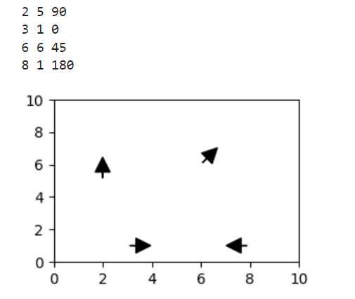

# Web in Python 
*<font size = 2>--Every Webpage is a Tree</font>*

## Introduce web
**HTML（HyperText Markup Language）**：一种创建网页的标准标记语言 TAG NAME
```python
<h1> - <h6> # => header 其中 1 - 6 是控制header 字体的大小（从大到小）
#eg.
<h1></h1>


<p></p> # => 段落

<a href="https://www.runoob.com">URL</a> # => this is url

<br><br>  # html image

<li></li>  # => list item

<ul></ul> # => unsorted list

<div></div> # => 定义级块元素，通胀用作容器来组织页面上的其他元素
<table boarder = "1"></table>  #=> 标签创建一个带有边框的表格
<tr></tr> # => row
<td></td> # 定义了表格中的标准单元格（table data）。它通常用于在表格（<table>）内部创建一个单元格

#eg.

<ul>
    <li><a href="browse.html">Browse</a></li>
    <li><a href="donate.html?from=A" style = "color:red">Donate</a></li>
    <button onclick="subscribe()">Subscribe</button>
</ul>


<b></b> # => 文本加粗

```
**HTTP Response**: HTTP 响应是指在客户端（如浏览器）向服务器发送HTTP请求后，服务器返回给客户端的信息。

Status: 
404 : Not Found/n
429 : To Many Request
500 : There has some BUG
200 : OK
405 ：Method not allow


## Selenium
<font size = 2>Selenum is most commonly used for testing web, but it works great for tricky scraping too</font>


-can fetch .html, .js, .etc file
-can run a .js file in browser
-can grab HTML version of <font color = "red">DOM(Document Object Model)</font> after JavaScript has modified it

<font color = "blue">*Document Object Model（DOM）是一种跨平台和语言独立的接口，它允许程序和脚本动态地访问和更新文档的内容、结构和样式。DOM 将一个 XML 或 HTML 文档表示为一个树状结构，其中每个节点都是文档中的一个对象，比如文档本身、元素、属性和文本。*</font>

```python
from selenium import webdriver
from selenium.webdriver.chrome.options import Options
from selenium.webdriver.common.by import By
from selenium.common.exceptions import NoSuchElementException
```

```python
options = Options() # => 用于配置chrome浏览器的启动选项
options.add_argument("--headless=new") # don't use a GUI (necessary on a VM)
# 无头模式，浏览器不会显示图形界面。
b = webdriver.Chrome(options=options) # => 这行代码初始化了一个Chrome浏览器的实例
url = ....
b.get(url) # sends HTTP GET request to the URL
# get方法用于指示浏览器导航到指定的
print(b.page_source)  # 获取当前页面的全部html代码，不包括Javascript 生成的HTML
```
<h5>Finding Element</h5>


```python
b.find_elements(By.ID, "alpha") # search for a specific element that matches ID\
# first match
# eg.
# <h1>Welcome</h1>
#     <h3>Here's a table</h3>
#     <table border="1" id="alpha">
#       <tbody><tr><td>A</td><td>B</td><td>C</td></tr>
#       <tr><td>1</td><td>2</td><td>3</td></tr>
#       <tr><td>4</td><td>5</td><td>6</td></tr>
#     </tbody></table>


b.find_elements(By.TAG_name, "table") # 上面的table就是一个TAG name
# find all tables

# 一些时候Javascript没有办法立刻生成新的表格，因此需要等待才能获取全部的table
# Polling：
# keeping checking regularly until you get all the details you are looking for
while True:
    tbls = b.find_elements(By.TAG_NAME, "table")
    print("Tables:", len(tbls))
        
    if len(tbls) == 2:
        print(tbls)
        break
     
    time.sleep(0.1) # sleep for 0.1 second


# get attribute value
a_elements = b.find_elements(By.TAG_NAME, 'a')
a_elements
for a in a_elements:
    print(a.get_attribute("href"), a.text)


output
https://tyler.caraza-harter.com/cs320/crawl/practice1/2.html 2   # 这里的2 和 3 是text value
https://tyler.caraza-harter.com/cs320/crawl/practice1/3.html 3
```

获取表格中的内容
```python
tbl = tbls[-1]

# TODO: find all tr elements
trs = tbl.find_elements(By.TAG_NAME, 'tr')

# TODO: find all td elements
# TODO: extract text for all td elements into a list of list
rows = []

for tr in trs:
    tds = tr.find_elements(By.TAG_NAME, 'td')
    assert len(tds) == 2
    
    rows.append([tds[0].text, tds[1].text])
# .text =>  获取页面元素的可见文本
rows
```
VM通过以上操作可以模拟browser对网页的操作，但是是无法直接查看到网页的，因此可以通过截图来或许网页内容。
```python
b.save_screenshot("some_file.png")# : saves a screenshot of the rendered page
# 可以通过b.set_window_size(width, height) 来修改screenshot的大小， 在save screenshot 之前使用
# import statement: 
from IPython.display import display Image
# helps us show the screenshot as an image inside the notebook

display(Image("page1.png"))  # through this operation we can see screen shot in notebook
```


事件触发和模拟
```python
## click
button_object.click()  # enable us to click the button
# first we need ues id to find button
button = b.find_element(By.ID, 'more')
# for this we can check html
# at this case, html is look like this => <button id="more" onclick="show()">Show More!</button>

# then we can us .click() operation to simulate browsers click button
button.click()


## password
text_object.send_keys()  # enables us to send data to textbox
# find text box
text = b.find_element(By.ID, 'password')   # tag name is input
# find click button
button = b.find_element(By.ID, 'login_btn') # tag name is button

# TODO: send the password (plain text just for example purposes)
text.clear() # first clean text box
#.clear() operation enables us to clear the previous text
text.send_keys('fido')

# TODO: click the button
button.click()


```
<h4> Selenium operations 合集</h4>
    
    b.get(URL): sends HTTP GET request to the URL

    b.page_source: HTML source for the page

    b.find_elements(By.ID, <ID>): searches for a specific element that matches the "id"

    b.find_elements(By.TAG_NAME, <TAG>): searches for a specific element using corresponding tag name

    b.find_element versus b.find_elements:
        find_element gives first match
        find_elements gives all matches

    <element obj>.text: gives text associated with that element

    <element obj>.get_attribute(<attribute>): gives attribute value; for ex: <anchor_obj>.get_attribute("href")

    b.save_screenshot("some_file.png"): saves a screenshot of the rendered page

    b.set_window_size(<width>, <height>): controls size of the image

    import statement: 
    from IPython.display import display, Image : helps us show the screenshot as an image inside the notebook

    button_element.click(): enables us to click the button

    text_element.send_keys(): enables us to send data to textbox


## Recursive Crawl
就像之前所说的Web是Tree结构，因此我们可以通过recursive的方法来获取所有web中的webpage
<font size = 3>crawling: process of finding all the webpage inside the website</font>


<h5>找到当前web的所有webpage</h5>

```python
def get_children(url):
    b.get(url)
    children = []
    a_elements = b.find_elements(By.TAG_NAME,"a")
    for a in a_elements:
        children.append(a.get_attribute('href'))
    return children

```
<h5>可以使用BFS找到当前web的所有子webpage</h5>
也就是说找到当前node的所有children -- 结合上面的get_children function

```python
# example url
start_url = "https://tyler.caraza-harter.com/cs320/crawl/practice7/1.html"

to_visit = deque([start_url])
added = {start_url}

while len(to_visit) > 0:
    cur_page = to_visit.popleft()
    print("cur:", cur_page)
    #g.node(cur_page.split("/")[-1])  #diagraph

    children = get_children(cur_page)

    for child in children:
        if not child in added:
            #g.edge(cur_page.split("/")[-1], child.split("/")[-1])
            to_visit.append(child)
            added.add(child)


```
if we uncomment code, we can get this result


## Flask


Flask是一个用Python编写的轻量级Web应用框架，它允许开发者快速地开发Web应用。在开发过程中，开发者会在本地计算机上启动一个Web服务器来测试他们的应用
```python
import flask
# flask syntax
app = flask.Flask("my application") # name of the web application can be anything

if __name__ == "__main__":
# 这行代码检查是否是直接运行这个脚本，而不是从另一个脚本导入它。在Python中，如果一个文件被直接运行，那么它的__name__变量会被设置为"__main__"
    app.run(host="0.0.0.0", debug=True, threaded=False) # this line will running forever, until program kill.
    #这行代码启动Flask应用的Web服务器。
```
默认情况下index.html会被默认为web的Home Page
```python
@app.route("/")  # 默认将index.html 作为homepage， 当前目录里必须有index.html文件
def home():
    with open("index.html") as f:
        html = f.read()
    return html

```
inside index.html

    <h1> Welcome </h1>


开始服务器
```python
python3 -m http.server # 打开：8000 服务器上应用程序监听的端口号
```
HTTPS: Hypertext Transfer Protocol Secure(超文本传输安全协议)
<font size = 2>是HTTP的安全版本。它用于在互联网上安全地传输数据，确保数据传输过程中的加密和完整性，以及网络通信双方的身份验证。</font>


URL的格式大致为协议://主机地址:端口号/路径
<font color = "red">Part1:Part2/Part3</font>

    Part1 means get request to correct computer
    Part2 means get request to correct server process
    Part3 means specify what resource we want from the server


<h4>Add Dynamic Content to File</h4>

```python
@app.route("/ha.html")
def laugh():
    return "haha" * 1000
# but in real life we only need to change part of the webpage
# TEMPLATE semi-static / semi-dynamic

@app.route("/time.html")
def time():
    with open("time.html") as f:
        html = f.read()   #html will be read as string
    html = html.replace("REPLACE", str(time.time())) # import time
    return html
# .replace() operation can replace element in html file
```
inside time.html

    <h1>time</h1>
        <p> Current time is REPLACE seconds after 1970.</p>


<h4> Rate Limiting</h4>
limit user visit webpage -- eg. If the user accesses the Web page several times in a short period of time, 429 Error will appear

```python
last_visit = 0

@app.route("/slow.html")
def slow():
    # if allow to visit:
    #     return regular content
    # else:
    #     return some warning here
    global last_visit  # showing that this is from global
    if time.time() - last_visit > 3:
        last_visit = time.time()
        return "Welcome"
    else:
        return flask.Response("<b>go away</b>",
                             status = 429,
                             headers = {"Retry-After": "3"})


```
<h4>flask.request </h4>
封装了客户端发起的HTTP请求的所有细节。通过它，你可以访问请求相关的数据，如请求头（Headers）、查询字符串（Query String）、表单数据、JSON数据、文件等。

以下是一些常用的flask.request属性和方法：

    request.method：获取当前请求的HTTP方法，例如GET、POST等。
    request.args：一个包含所有查询字符串参数的不可变字典（ImmutableMultiDict）。
    request.form：一个包含所有表单数据的不可变字典，用于处理POST或PUT请求的表单数据。
    request.json：如果请求是JSON格式的数据，这个属性包含解析后的JSON数据。
    request.files：一个包含所有上传文件的字典。
    request.headers：一个包含所有HTTP请求头的字典。
    flask.request.remote_addr: 可以获取访问网页的用户ip 地址


<h4>flask.response </h4>
代表了服务器发给客户端的HTTP响应。Flask允许你通过多种方式来构建响应对象。最简单的方式是直接从视图函数返回一个字符串和一个状态码，Flask会自动将其转换为一个响应对象。
在header中你可以添加任何你需要的东西作为 meta data

创建新的route，告诉爬虫哪些网页是可以获取的，哪些是不可以的

```python
@app.route("/never.html")
def never():
    return "human only, bots are note allowed"

# TODO: create a robots.txt page
@app.route("/robots.txt")
def bot_rules():
    return flask.Response("""
    User-Agent: *
    Disallow: /never.html
    """, headers={"Content-Type": "text/plain"})
# flask.Response: enables us to create a response object instance
# 		  Arguments: str representing response, headers dict representing metadata


```


<h4>urllib.robotparser模块</h4>
目的是解析指定网站的robots.txt文件。robots.txt是一个位于网站根目录下的文本文件，它告诉网络爬虫（搜索引擎的爬虫或其他自动化服务）哪些页面可以被抓取，哪些不可以。通过解析这个文件，程序可以遵守网站的爬虫政策，只访问允许访问的资源。


```python
import urllib.robotparser
rp = urllib.robotparser.RobotFileParser()
rp.set_url(base_url + "robots.txt")
rp.read()


rp.can_fetch("cs320bot", base_url + "/slow.html")

# 使用can_fetch(user_agent, url)方法时，你需要提供两个参数：

# user_agent: 代表请求检查权限的用户代理的名称。
# url: 需要检查是否允许访问的完整URL。
# 方法会返回一个布尔值：

# 如果返回True，则表示根据robots.txt的规则，提供的用户代理被允许访问指定的URL。
# 如果返回False，则表示根据robots.txt的规则，提供的用户代理不被允许访问指定的URL。
```


<h4>Query String</h4>
<font size = 2>用于传递额外的参数给Web服务器</font>
example:

    http://example.com/page?key1=value1&key2=value2

    ? 符号用于标识查询字符串的开始。
    key1=value1 表示第一个参数，其中key1是参数名，value1是参数值。
    & 符号用于分隔多个参数。
    key2=value2 表示第二个参数，其中key2是参数名，value2是参数值。

How to use query string?
```python
@app.route("/add.html")
def adder():                # args is query string argument
    args = dict(flask.request.args) # request -> user send to flask server
    # args is arguments
    try:
        x = float(args["x"])
        y = float(args["y"])
    except KeyError:
        return "Please tell me x and y"
        
    return f"{x} + {y} = {x+y}"

```
如果少了一个参数，则会返回报错信息。

    http://34.134.230.194:5000/add.html?x=2&y=3


**<font color = "red">Query String is ImmutableMultiDict</font>**
它的数据结构是非常类似于dict的，但是不同的是他是immutable的，无法修改。可以通过转换为dict来使用query string.


```python

major_counts = {}


@app.route("/survey.html")
def survey():
    major = flask.request.args.get("major","unknow")
    
    if major not in major_counts:
        major_counts[major] = 0
    major_counts[major] += 1    
    client_ip = flask.request.remote_addr
    response = 'Your IP address is {}. '.format(client_ip)
    # format方法是Python中常用的字符串格式化方法之一，它允许你在字符串中插入一个
    # 或多个占位符{}，然后通过format方法提供的参数替换这些占位符。


    response += "Majors: " + json.dumps(major_counts)
    
    return response
# client flask.request => server
#.args => query string
# .remote_addr => IP address that sends this request
# server flask.Response(...) => client
# content, status, header(content-type, retry-after)
```


## A/B Testing

是一种用于比较两个版本的网页或应用（版本A和版本B），以确定哪一个版本表现更好的统计分析方法。

Example Metric: CTR(Click-Through Rate)
CTR = clicks / impressions
"impression" means user sas it: that is, Impression = click + no clidk


Pvalue smaller means more likely that A ≠ B

in this example threshold is 5% => 0.05
pvalue is 0.189
hence we have enough evidence that A ≠ B

A/B testing: 将用户随机分配到两个或者多个版本页面

A/A testing: 验证测试系统有效性

当在A/B testing 结束后，发现 B version更好，但是担心是novelty原因，因此 可以switch to B and do B/A testing。


担心 Version B 可能 terrible 但是你依然想要计算它。因此你需要starting with 0% of B, then slowly increase.

**simple size 也会影响A/B testing的结果**
example：


----------------------------------------------------------


## matplotlib

```python
import matplotlib.pyplot as plt

```
PNG => representated by pixel, each pixel => RGB value
以bytes来储存，因此需要使用"wb"和"rb"
rb: 代表 "read binary"（读取二进制）。这个模式用于读取二进制文件，如图片、视频、可执行文件等。在这个模式下，文件被视为二进制流，读取的数据不会以任何方式被自动转换或解码。

wb: 代表 "write binary"（写入二进制）。当你需要将数据以二进制格式写入文件时，会使用这个模式。这同样意味着文件被视作二进制流，写入的数据不会进行任何自动的转换或编码。

SVG => representated by test
good for data analyse

```python

   #=> html 中插入图片

```
```python
import io # input output => StringIO(fake text file)
# => BytesIO(fake bytes file)


@app.route("/plot1.png")
def plot1():
    fig, ax = plt.subplots(figsize = (3,2)) # Figure对象，
    pd.Series(temperature).plot.line(ax = ax)
    ax.set_xlabel("T")
    ax.set_ylabel("temperature")
    plt.tight_layout()
    # v1 
    # with open("temp.png","wb")as f:   # too slow
    #     fig.savefig(f)
    # with open("temp.png","rb")as f:
    #     return f.read()
    # v2 - write and read on a fake bytes file
    f = io.BytesIO() # create temprate fake bytes file   
    fig.savefig(f) # don't need to create local file
    plt.close()
    return flask.Response(f.getvalue(), headers ={"Content-Type": "image/png"})
    # Content-Type 是一个字段，它指示了主体内容（body）的媒体类型（MIME类型）。
    # 如果没有这段命令，图片源码则会使乱码

    # f.getvalue() 通常与字符串IO相关，特别是在使用 io.StringIO 或 io.BytesIO 类时。
    # 这些类是内存中的文件对象，支持文件对象的大部分方法。StringIO 用于处理文本数据，
    # 而 BytesIO 用于处理二进制数据。当你向这些对象写入内容后，可以使用 getvalue() 方法来获取写入的数据。
```


```python

@app.route("/plot2.svg")
def plot2():
    fig, ax = plt.subplots(figsize = (3,2))
    pd.Series(temperature).plot.line(ax = ax)
    ax.set_xlabel("T")
    ax.set_ylabel("temperature")
    plt.tight_layout()
    
    f = io.StringIO() # create fake text file
    fig.savefig(f, format="svg")  # default format is png
    plt.close()
    return flask.Response(f.getvalue(), headers ={"Content-Type": "image/svg+xml"})
# TODO: add route for "/upload"

```


<h4>使用query string 来改变图片</h4>

```python

@app.route('/upload')
def temp_upload():
    temps = flask.request.args["temps"]
    for t in temps.split(","):
        temperature.append(float(t))
    return f"You now have {len(temperature)} entries of temps."


# post request
@app.route('/postupload', methods=["POST"])
def temp__post_upload():
    temps = str(flask.request.get_data(),"utf-8") # get out data that was send through post request
    for t in temps.split(","):
        temperature.append(float(t))
    return f"You now have {len(temperature)} entries of temps."

```


## Regular Expression

<font color="red"> / </font> is sign for escape original meaning  
```python
print("A\tB")

output:
A   B
```

<font color="red"> r </font> is a raw string, which means it will return the original string.  
```python
print(r"A\tB")

output:
A\tB
```
same as  

```python
print("A\\tB")

output:
A\tB
```
"\\" and "r" cancel original mean of character of sign, "\t" mean tab, and those two sign cancel "\t" mean, hence, the code will print "\t".


<h4>Character classes</h4>

    Character classes can be mentioned within [...]
    ^ means NOT of a character class
    - enables us to mention range of characters, for example [A-Z]
    | enables us to perform OR


<h4>Metacharacters</h4>
predefined character classes

    \d => digits
    \s => whitespace (space, tab(\t), newline)
    \w => "word" characters (digits, letters, underscores, etc) --- helpful for variable name matches and whole word matches (as it doesn't match whitespace --- \s)
    . => wildcard: anything except newline
    capitalized version of character classes mean NOT, for example \D => everything except digits


<h4>REPETITION</h4>

    <character>{<num matches>} - for example: w{3}
    matches cannot overlap

<h4>Variable length repitition operators</h4>

    * => 0 or more (greedy: match as many characters as possible)
    + => 1 or more (greedy: match as many characters as possible)
    ? => 0 or 1
    *? => 0 or more (non-greedy: match as few characters as possible)
    +? => 1 or more (non-greedy: match as few characters as possible)

<h4>Anchor characters</h4>

    ^ => start of string
    ^ is overloaded --- what was the other usage?
    $ => end of string


<h4>Re Module</h4>

    re.findall(<PATTERN>, <SEARCH STRING>): regular expression matches
    returns a list of strings
    re.sub(<PATTERN>, <REPLACEMENT>, <SEARCH STRING>): regular expression match + substitution
    returns a new string with the substitutions (remember strings are immutable)


<h5>Group</h5>
we can capture matches using () => this is the special meaning of ()
returns a list of tuples, where length of the tuple will be number of groups

email example

```python
s = """
Yiyin [Instructor] - yshen82 (AT) wisc.edu
Daisuke (TA): dyamada2@wisc.edu
Garrison (Peer Mentor) - gwaugh [at]wisc.edu
"""

netid = r"\w+"
at = r"@|[\(\[][aA][tT][\)\]]"
domain = r"\w+\.(edu|com|org|net|io|gov)"

full_regex = f"\s*({netid})\s*({at})\s*({domain})"

re.findall(full_regex, s)


output

[('yshen82', '(AT)', 'wisc.edu', 'edu'),
 ('dyamada2', '@', 'wisc.edu', 'edu'),
 ('gwaugh', '[at]', 'wisc.edu', 'edu')]


print("REGEX:", full_regex)
for match in re.findall(full_regex, s):
    print(f"{match[0]}@{match[3]}")

output

REGEX: \s*(\w+)\s*(@|[\(\[][aA][tT][\)\]])\s*(\w+\.(edu|com|org|net|io|gov))
yshen82@edu
dyamada2@edu
gwaugh@edu
```


## Visualization

像原形，三角形，这样的图片在matplot中被称为patches
plt.Circle((<x>, <y>), <radius>)


    Drawing a circle
    Type plt. and then tab to see a list of patches.
    plt.Circle((<x>, <y>), <radius>)
    To see the cicle, we need to invoke either:
    ax.add_patch(<circle object>)
    ax.add_artist(<circle object>)
    this invocation needs to be in the same cell as the one that draws the figure
    Is there a difference between ax.add_patch and ax.add_artist?
    ax.autoscale_view(): automatically chose limits for the axes; typically works better with ax.add_patch(...)


ax.add_artist 和 ax.add_patch 是 Matplotlib 中用来向轴（Axes）对象添加绘图元素的两个方法，但它们在使用和适用范围上有所不同。

ax.add_artist(artist):

这个方法非常通用，允许你向轴（Axes）添加任何艺术家（Artist）对象。在 Matplotlib 中，艺术家（Artist）是所有绘图元素的基类，包括图形（如线条、文本、图像等）和容器（如轴、图形等）。因此，add_artist 方法可以用来添加各种类型的绘图元素，只要它们是 Artist 的子类。
使用 add_artist 方法时，需要确保所添加的艺术家对象的坐标系统与轴对象匹配，或者已经适当设置了转换。
ax.add_patch(patch):

这个方法专门用于向轴添加“补丁”（Patch）对象。补丁是指那些有形状和颜色的图形元素，如圆形、矩形、多边形等。add_patch 方法是 add_artist 方法的一个特殊情形，专门针对补丁这一类的艺术家对象。
使用 add_patch 方法添加补丁时，通常不需要担心坐标转换，因为补丁对象通常是以数据坐标来定义的，它们自动适应轴的坐标系统。


```python
fig, ax = plt.subplots(figsize=(6, 4))
#Let's draw a circle at (0.5, 0.5) of radius 0.3
c = plt.Circle((0.5, 0.5), 0.3)
# Add the circle to the AxesSubplot
ax.add_patch(c)

```


```python
type(c)

output
matplotlib.patches.Circle

type(c).__mro__

output:
(matplotlib.patches.Circle,
 matplotlib.patches.Ellipse,
 matplotlib.patches.Patch,
 matplotlib.artist.Artist,
 object)

# 是 Python 中的一个表达式，用于展示一个对象 c 的类型的方法解析顺序(Method Resolution Order,MRO)。
#这个顺序是 Python 用于确定当你调用一个方法时，应该从哪个父类中寻找该方法的规则。
#这个特性主要在面向对象编程中使用，尤其是在涉及到多继承的情况下
```


现在我们得到的图片看起来并不是一个圆，因此我们需要通过一些方法来将其变成一个圆
一个最简单的方法就是修改图片尺寸

```python
fig, ax = plt.subplots(figsize = (4,4))
c = plt.Circle((0.5, 0.5), 0.3)
ax.add_artist(c)

```


或者可以使用ax.set_aspect(<ratio>): how much space y axes takes with respect to x axes space(y轴相对于x轴占用了多少空间)


```python
fig, ax = plt.subplots(figsize=(6, 4))
c = plt.Circle((0.5, 0.5), 0.3)
ax.add_artist(c)
# Set aspect for y-axis to 1
ax.set_aspect(1)

```


```python
fig, ax = plt.subplots(figsize=(6,4))
# Set x axis limit to (0, 3)
ax.set_xlim(0, 3)
c = plt.Circle((0.5, 0.5), 0.3)
ax.add_artist(c)
# Set aspect for y-axis to ???
ax.set_aspect(3)

```


<h4>Transformers</h4>
<b>ax.transData: default</b>

Axes 对象（通常用 ax 表示）的属性，它表示使用数据的原始坐标系统。这是默认的变换器，用于绘制大多数图形元素，如点、线等，这些元素的位置是基于数据坐标的。
使用此变换，坐标被解释为图表数据空间中的点，使得 (x, y) 坐标直接对应于数据点的位置。

    plt.Circle((<x>, <y>), <radius>) 

```python

fig, (ax1, ax2) = plt.subplots(figsize=(6, 4), ncols=2)
# Set right subplot x-axis limit from 0 to 3
ax2.set_xlim(0, 3)

# Left subplot: plot Circle at (0.5, 0.5) with radius 0.2
# Specify CRS as ax1.transData (tranform parameter)
c = plt.Circle((0.5, 0.5), 0.2, transform=ax1.transData) # 就 ax1 而言在坐标轴的0.5 0.5 的位置
#画一个半径为0.2的圆，基于ax1坐标轴范围的基础上
ax1.add_artist(c)

# Right subplot: plot Circle at (0.5, 0.5) with radius 0.2
# default: transform=ax2.transData
c = plt.Circle((0.5, 0.5), 0.2, transform = ax2.transData) 
ax2.add_artist(c)
# Observe that we get a different circle

# Transform based on ax1, but crop based on ax2
# Left subplot: plot Circle at (1, 1) with radius 0.3 and crop using ax2
c = plt.Circle((1, 1), 0.3, transform=ax1.transData) # where to position the shape 
ax1.add_artist(c)  # how to crop the shape

# 同理，这是在ax1坐标轴基础上画一个中心点在1，1， 半径为0.3的圆

# Right subplot: plot Circle at (1, 1) with radius 0.3 and crop using ax1
c = plt.Circle((1, 1), 0.3, transform=ax1.transData) # where to position the shape
ax2.add_artist(c)  # how to crop the shape
# 这是同理，只不过这一部分展示的是ax2部分所绘制出来的圆。


```


<h4>ax.transAxes and fig.transFigure</h4>
(0, 0) is bottom left
(1, 1) is top right
these are true immaterial of the axes limits
Think of the positions as percentage of the entire plot

ax.transAxes
根据坐标轴来定，例如x轴是3， 但是Circle中的x是0.2， 那么中心点会在0.6的位置。


而 fig.transFigure 是正对整个图形来确定的，具体参考红色的圈

```python
fig, (ax1, ax2) = plt.subplots(figsize=(6, 4), ncols=2)
ax2.set_xlim(0, 3)

# Left subplot
c = plt.Circle((0.5, 0.5), 0.2, transform = ax1.transAxes)
ax1.add_artist(c)

#Right subplot
c = plt.Circle((0.2, 0.8), 0.2 , transform = ax2.transAxes)
ax2.add_artist(c)

# whole figure
#edgecolor="red", facecolor="none", linewidth=3
c = plt.Circle((0.5, 0.5), 0.2, transform = fig.transFigure,edgecolor="red", facecolor="none", linewidth=3)
fig.add_artist(c)

```


    数据坐标（default）：形状的位置和大小以与坐标轴上绘制的数据相同的坐标给出。
    例如，如果您在图表上绘制一个圆，数据集的范围在两个轴上都是从 0 到 100，
    用数据坐标指定半径会根据轴的数据限制来缩放圆。

    轴坐标 (transform=ax.transAxes)：形状的位置和大小以轴坐标给出，其中 (0, 0) 是轴
    的左下角，(1, 1) 是右上角。当您想根据轴的大小定位形状，而不考虑数据的比例时，这很有用。

    图形坐标 (transform=fig.transFigure)：类似于轴坐标，但相对于整个图形。
    这里，(0, 0) 是图形的左下角，(1, 1) 是右上角。这适用于在图形中的特定位置定位某物，而不考虑任何单个轴。

    显示坐标 (transform=None 与在图形或画布上直接放置对象的上下文中使用)：
    这里，位置和大小以相对于显示器或图形画布的像素给出。这种用法很少用于绘制数据，
    但对于需要固定位置的 GUI 元素或注释很有用，无论放大或调整大小。


plt.tight_layout()：可以自动调整子图参数，以便子图之间以及子图与图形边缘之间填充适当的空间

```python

fig, (ax1, ax2) = plt.subplots(ncols=2, figsize=(6, 4))
ax2.set_xlim(0, 3)

# What is the dpi?
print(fig.dpi)   # dots (aka pixel) per inch

# Calculate total width and height of the figure using dpi and dimensions
width = 6 * fig.dpi
height = 4 * fig.dpi

# # Calculate (x, y) in the middle of the plot
x = width / 2
y = height / 2
print(x, y)

# # Make sure to invoke plt.tight_layout()
# # matplotlib does the cropping better than Jupyter
plt.tight_layout() # author adjust withe sapce

# Draw a circle at (x, y) with radius 30
# Make sure to set transform=None
c = plt.Circle((x, y), 30, transform = None) # 如果说plt.tight_layout()在这个命令之后
# 那么我们的图片则会根据还没有自动填充适当空间之前有很多white space的空间来进行绘制。
fig.add_artist(c)
# Save the figure to temp.png
fig.savefig("temp.png")


```


None or IdentityTransform(): disabling CRS（坐标轴系统 Geographic Coordinate System）


fig.dpi

fig.dpi 是指图形的分辨率，以每英寸点数（dots per inch, DPI）来度量。这个属性影响了图形的大小和质量，特别是当你将图形保存到文件时。
较高的 DPI 值意味着更高的图形质量和更清晰的图像，但同时也意味着生成的文件可能会更大

eg. 我的width是6，那么我就会有600 dpi。


ax.transData.transform((x, y)) 在 Matplotlib 中用于将坐标从数据坐标系（或称为轴坐标系）转换为原始像素坐标。这个过程对于进行精确的图形布局或当你需要将图形元素与特定的像素位置对齐时非常有用。


```python

fig, (ax1, ax2) = plt.subplots(ncols=2, figsize=(6, 4))
#使用 plt.subplots(ncols=2, figsize=(6, 4)) 创建一个图形对象 (fig) 
#和两个子图轴对象 (ax1 和 ax2)。这意味着整个图形被分为两个并排的子图，
#图形大小为宽6英寸，高4英寸。
ax2.set_xlim(0, 3)
#通过 ax2.set_xlim(0, 3) 设置 ax2 的 x 轴显示范围为0到3
# crop now (after .transform, we don't want to move anything!)
plt.tight_layout() 
#调整子图的布局，使得图形中的各个元素不会重叠，看起来更加整洁。
x, y = ax2.transData.transform((0.5, 0.5)) # 转换成像素坐标
# 将数据点 (0.5, 0.5) 转换为 ax2 子图的像素坐标 (x, y)。
print(x, y)
# Draw a circle at (x, y) with radius 30 and set transform to None
c = plt.Circle((x, y), 30, transform=None)
#创建一个半径为30像素的圆形 plt.Circle((x, y), 30, transform=None)，并将其添加到 ax2。
#这里的 transform=None 表示使用原始的显示坐标系（像素坐标），这个圆形的中心位于由
#数据点 (0.5, 0.5) 转换而来的像素位置。
ax2.add_artist(c)

# # GOAL: arrow from 0.2, 0.2 (left) to 2, 0.5 (right)
# # Use axes / data coords from one subplot to another subplot
x1, y1 = ax1.transData.transform((0.2, 0.2))  # transform is a good way draw out thing in two subplot at same time
x2, y2 = ax1.transData.transform((2, 0.5)) # 转换像素坐标
arrow = matplotlib.patches.FancyArrowPatch((x1,y1),(x2,y2),transform=None,arrowstyle="simple,head_width=10,head_length=10" )
# 这个箭头图像是基于整个图形而言的，看图。
fig.add_artist(arrow)

```


```python

df = pd.DataFrame([
    {"x":2, "y":5, "a": 90},
    {"x":3, "y":1, "a": 0},
    {"x":6, "y":6, "a": 45},
    {"x":8, "y":1, "a": 180}
])
df


fig, ax = plt.subplots(figsize=(3,2))
ax.set_xlim(0, 10)
ax.set_ylim(0, 10)

for row in df.itertuples():
    print(row.x, row.y, row.a)
    # v1: draw a circle for each scatter point
    
    x, y = ax.transData.transform((row.x,row.y))   # 因为在这里已经用transdata去得到了我的pixel因此在下面就不需要再重新获得， 可以直接使用transform = None
    c = plt.Circle((x,y), radius=10, transform = None)
    # ax.add_artist(c)
    
    # v2: draw an arrow for each scatter point (correct angle)
    # x, y = ???
    # # Calculate angle: math.radians(row.a)
    a = math.radians(row.a)
    # # Calculate end axes / data coords using 
    x_diff = math.cos(a) * 25
    y_diff = math.sin(a) * 25
    c = matplotlib.patches.FancyArrowPatch((x,y), (x+x_diff,y+y_diff), color="k", transform = None, arrowstyle = "simple,head_width=10,head_length=10")
    ax.add_artist(c)
```




    ax.text
    ax.text 用于在图表的指定位置添加文本。通过调整文本的对齐方式，可以精确地控制文本在图中的位置。这在添加注释或解释图表的特定部分时非常有用。

    <x>, <y>: 这是文本在图表中的位置。坐标是基于当前轴（Axes）的数据坐标系统。
    <text>: 你想要显示的文本字符串。
    ha=<someval>: 水平对齐方式。<someval> 可以是 'center', 'right', 或 'left'。这决定了文本相对于其 x 坐标的对齐方式。
    va=<someval>: 垂直对齐方式。<someval> 可以是 'center', 'top', 'bottom', 'baseline', 或 'center_baseline'。这决定了文本相对于其 y 坐标的对齐方式。
    通过调整 ha 和 va 参数，你可以控制文本的“锚点”，即文本相对于其指定位置的确切对齐方式。

    plt.Line2D
    plt.Line2D 用于创建线条对象，这在需要绘制自定义线条或强调图表中的特定部分时特别有用。

    (<x1>, <x2>): 线条的起点和终点的 x 坐标。
    (<y1>, <y2>): 线条的起点和终点的 y 坐标。
    这些坐标确定了线条在图表中的位置和方向。

    plt.Rectangle
    plt.Rectangle 用于在图表中添加矩形。这可以用来高亮图表中的特定区域，或者绘制柱状图、条形图等。

    (<x>, <y>): 矩形左下角的坐标。
    <width>, <height>: 矩形的宽度和高度。
    通过调整这些参数，你可以控制矩形的大小和位置。


```python
plt.rcParams["font.size"] = 16
df = pd.DataFrame({"A": [1,2,8,9], "B": [5,7,12,15]}, index=[10,20,30,40])
ax = df.plot.line(figsize=(4,3), legend=False)
ax.set_xlabel("Day")
ax.set_ylabel("Amount")
plt.tight_layout()
# Enables us to control borders (aka spines)
ax.spines['top'].set_visible(False)  # 取消图片中的右边和上面的边框
ax.spines['right'].set_visible(False)
# 1. Replace legened with line labels
for col in df.columns:
    ax.text(df.index[-1],df[col].iat[-1],col, ha = "left", va = "center")# 修改AB的具体位置。

# 2. Draw a vertical line at x=20
p = plt.Line2D((20,20),ax.get_ylim(),color = "r", linestyle="--")
ax.add_artist(p)
# 3. Highlight a region from x=25 to x=35
p = plt.Rectangle((25,0), 10, ax.get_ylim()[1], color = 'k', zorder = -50, alpha = 0.2, linewidth = 0) # 控制图层哪个在上面哪个在下面，目前这个是黑色长方形在两个线条下面
# alpha 控制 transparent 透明度， alpha = 1 就是完全黑，alpha = 0 就是白色，alpha = 0.2 如图所示。
# linewidth = 0 控制方块没有边框
ax.add_artist(p)
df
# ax.get_ylim()# 这个方法返回一个元组，包含两个元素：y 轴的最小值和最大值。

```


## Geopandas

geopandas 是 pandas datafram 的子类


    Polygon([(<x1>, <y1>), (<x2>, <y2>), (<x3>, <y3>), ...])
    Polygon 对象用于表示一个封闭的多边形区域。这个区域由一系列顶点（或称为点、坐标）定义，
    这些顶点按顺序连接形成多边形的边界，最后一个顶点会与第一个顶点连接，形成一个封闭的环。


    box(<minx>, <miny>, <maxx>, <maxy>)
    函数用于快速创建一个矩形多边形（Polygon 对象）。这个矩形是由左下角的坐标 (minx, miny) 
    和右上角的坐标 (maxx, maxy) 定义的。


    Point(<x>, <y>) 特定位置有一个点。


    <shapely object>.buffer(<size>)
    example: Point(5, 5).buffer(3) creates a circle
    .buffer(size) 方法用于为几何对象创建一个缓冲区，这个缓冲区是围绕原始对象的一定距离的区域。
    size 参数指定了缓冲区的宽度，即原始对象到缓冲区边界的距离。


    Shapely methods:
    union: any point that is in either shape (OR)
    并集操作创建一个新的几何对象，它包含在两个输入几何对象中的任意点。
    如果你把这两个对象想象成集合，union 方法返回的结果就是这两个集合所有元素的组合，没有重复。

    intersection: any point that is in both shapes (AND)
    交集操作生成一个包含两个输入几何对象共有部分的新几何对象。只有同时在两个对象中的点才会出现在结果中。

    difference: subtraction 差集操作从第一个几何对象中减去与第二个对象重叠的部分，
    生成一个包含所有只在第一个对象中的点的新几何对象。

    intersects: do they overlap? return T/F


```python
eur.plot(facecolor="lightgray", edgecolor="k")
eur.centroid
# centroid 获取图像的质心
eur.centroid.plot()
```


```python
eur.plot(facecolor="lightgray", edgecolor="k")

eur.centroid.plot(ax = ax)
```


这些plot都是使用lat和long进行绘制的

```python
eur.crs
eur.to_crs["EPSG:335"]
```


.crs属性代表坐标参考系统（Coordinate Reference System，CRS）。坐标参考系统是用于确保地理数据在地球表面的正确表示的系统。它可以是基于地理坐标的系统（使用经纬度度量），也可以是基于投影的系统（将地球表面映射到一个平面上）。


to_crs方法在geopandas中的作用是将地理空间数据（存储在GeoDataFrame或GeoSeries中）从一个坐标参考系统（CRS）转换到另一个。 

Web地图通常使用Web Mercator投影（EPSG:3857），而科学研究或全球视图可能更倾向于使用WGS 84（EPSG:4326）   

这些api可以图片和数据更加准确


```python
eur_m.area # area in sq meters
```

在geopandas中，.area属性用于计算GeoDataFrame或GeoSeries中每个几何对象的面积。这个属性返回一个pandas系列（Series），其中包含了每个几何形状的面积计算结果，单位通常依赖于几何对象当前的坐标参考系统（CRS）。

获取面积的单位是米

```python
eur_m.area / 1000 / 1000 / 2.59  #单位转换 meter to miles


# 没有使用eur.to_crs["EPSG:335"] 然后使用area获取到的面积是基于图片的，而不是实际的，
# 而使用了的则就是实际面积，非常大， 通常需要单位换算
```


```python
city = gpd.read_file("City_Limit.zip").to_crs("EPSG:32616")
# 3rd digit (6 stands for north hemisphere, 7 stands for south)
# last two digits stand for the vertical mercator coordinate 
city.crs

water = gpd.read_file("Lakes_and_Rivers.zip").to_crs(city.crs)
fire = gpd.read_file("Fire_Stations.zip").to_crs(city.crs)
police = gpd.read_file("Police_Stations.zip").to_crs(city.crs)

url = "https://maps.cityofmadison.com/arcgis/rest/services/Public/OPEN_DATA/MapServer/2/query?outFields=*&where=1%3D1&f=geojson"
police2 = gpd.read_file(url).to_crs(city.crs)
```
